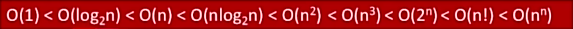

# 基础
## 概念
数据：是**信息的载体**，描述客观事物的数、字符及所有**能输入到计算机中并被计算机程序识别**和处理的符号的集合，是计算机程序加工的原料
数据元素是数据的基本单位，通常作为一个整体进行考虑和处理，数据元素可由若干数据项组成，数据项是构成数据元素不可分割的最小单位

数据结构：各个元素之间的关系，存在一种或多种特定**关系**的数据元素的集合（例如键值对）
数据对象：具有**相同性质**的数据元素的集合，是数据的一个子集

若采用**顺序存储**，则各个数据元素在**物理上必须是连续的**；**非顺序存储则是离散的**
数据的**存储结构会影响存储空间分配的方便程度**，也会影响**数据运算的速度**

**数据类型**：是一个值的集合和定义在此集合上一组操作的总称
	 - 原子类型：其值不可再分的数据类型（基本类型）
	 - 结构类型：可以再分成若干成分（分量）的数据类型 （对象也是类型，可以分成具体的成分，例如坐标可以被分为经度和纬度）
**抽象数据类型**(ADT，Abstract Data Type):是抽象数据组织及与之相关的操作。
## 三要素
如何**定义**一个结构，如何**运算/处理**一个结构，如何**存储**一个结构
### 逻辑结构
**集合**：同属一个集合，无其他任何关系，例如花和草同属植物
**线性结构**：一对一，承上启下（仅针对相邻元素），除了第一个和最后一个仅有1个相关
**树形结构**：一对多，树状图
**图结构**：多对多，网状结构

### 物理结构
也可认为是存储结构，分为**顺序存储、链式存储、索引存储、散列存储**
顺序存储：将**逻辑上相邻的结构存储在物理上也相邻的存储单元**中，元素之间的关系由存储单元的邻接关系体现，在内存上需要一块连续的存储空间
链式存储：**逻辑上相邻的元素在物理位置上可以不相邻**，借助指示元素存储地址的指针表示元素之间的逻辑关系。
索引存储：**在存储元素信息时会建立索引表。索引表中每项被称为索引项**，索引项的一般形式是（关键字->地址）
散列存储：**根据元素的关键字算出存储地址，又称为“哈希存储”**

### 数据运算
施加在数据上的运算定义和实现。运算的**定义针对逻辑机构**，指出运算的功能；**实现针对存储结构**，指出运算的具体操作步骤。
针对于某种逻辑结构，结合实际需求，定义**基本运算**

## 算法
**`程序=数据结构+算法`**
算法(Algorithm)**是对特定问题求解步骤的一种描述**，是指令的**有限**序列，其中每条指令表示一个或多个操作
算法**必须具有有穷性**，步骤和时间都需要是有穷的。程序可以是无穷的，例如持续运行的进程；**必须具有确定性**，对于相同的输入只能得出相同的输出；**必须有可行性**，描述的操作都可以通过已经实现的基本运算执行有限次来实现；**必须具有输入(0+)或输出(1+)**，输入取自某个特定对象的集合，输出是与输入有某种特定关系的量。
#### "好"算法的特质
**正确性**：能够正确的解决求解问题
**可读性**：具有良好的，帮助人类理解的可读性
**健壮性**：输入非法数据时能适当的做出反应或处理，不会产生莫名其妙的输出结果
**高效率和低存储量**需求：**时间复杂度低，空间复杂度低**->花的时间少也不费内存
### 时间复杂度
1.**后统计法**，让算法先运行，受机器性能、编程语言性能、编译程序产生的机器指令质量 等有关，且有些算法不能事后再统计
2.**事先预估法**，**时间开销T(n)与问题规模n**的**关系**，当问题规模足够大时，可以只考虑阶数高的部分T<sub>3</sub>(n)=O(n<sup>3</sup>)。也**分为最好时间复杂度，最坏时间复杂度，平均时间复杂度**，对于某些数据来说，有可能仅需一次查找，有时候需要多次查找
- 语句频度

### 空间复杂度
大小固定(代码大小)，与问题规模无关。
如果S(n)=O(1),则可认为算法在**原地工作**,算法所需内存空间为常量。当加入数组时，因为数组中可存储不同的类型，所以实际占用的空间可能为4B,8B这类->O(n),如果成为二维数组，则会变为O($n^2$);函数递归调用时带来的内存开销也会增大，此时S(n)=递归算法的深度。

# 表
顺序表不方便动态分配，每次动态分配所需要的时间复杂度是大量的；随机存取时间开销很短，时间开销O(n)主要来自移动元素 
链表不方便随机存取，动态分配很方便，时间开销O(n)主要来自查找目标元素
对于动态分配：malloc和free是成对出现的
对于静态分配：通过声明一个数组或变量来说，在销毁后内存会自动进行回收，不需要free手动释放

| 操作维度  | 顺序表 / 静态链表（数组 + 游标）       | 链式存储结构（单链表）                   |
| ----- | ------------------------- | ----------------------------- |
| 查（访问） | **O(1)**，支持随机存取，可直接通过下标定位 | **O(n)**，需从头结点顺序遍历            |
| 改（修改） | **O(1)**，已定位情况下可直接修改      | **O(1)**（已定位），但**定位本身为 O(n)** |
| 增（插入） | **O(n)**，需整体移动元素          | **O(1)**（已定位），仅修改指针           |
| 删（删除） | **O(n)**，需整体移动元素          | **O(1)**（已定位），仅修改指针           |
| 存储空间  | 连续内存，空间利用率高，无指针额外开销       | 非连续内存，存在指针额外开销                |
| 扩容性   | **差**，需重新分配并整体拷贝          | **好**，可动态申请结点                 |
| 内存分配  | 一次性预分配                    | 按需动态分配                        |
| 适用场景  | 读多写少、规模稳定                 | 写多读少、规模变化频繁                   |

## 线性表
线性表是具有**相同数据类型**的n个数据元素的**有限序列**，n为表长，当n=0时线性表是空表。若用L表示，则表为 L=(a<sub>1</sub>,a<sub>2</sub>,...,a<sub>n</sub>)。
数据表中数据的具体位置称为**位序**,在数据结构中，**线性表的位序是从1开始的，而数组的下标是从0开始的**
a<sub>1</sub>是**表头元素**；a<sub>n</sub>是**表尾元素**
除第一个元素外，每个元素仅有一个**直接前驱**；除最后一个元素外，每个元素有且仅有一个**直接后驱**

### 基本操作
**初始化**(InitList(&L))表。构造一个空的线性表L，**分配内存空间**
**销毁表**(DestroyList(&L))。销毁线性表，并**释放**线性表L占用的**内存空间**

**插入**(ListInsert(&L,i,&e))。在表中第i个位置上插入元素e。
**删除**(ListDelete(&L,i,&e))。删除表中第i个位置的元素，并用e返回删除元素的值。

**按值查找**(GetElem(L,e))。在表L中查找具有给定关键字值的元素。
**按位查找**(LocateElem(L,e))。获取表L中第i个位置元素的值。
其他常用操作：
Length(L)、PrintList(L)、Empty(L)
***当需要进行引用操作时，可以在变量名前增添&，例如`int & x`***

## 顺序表
用顺序存储的方式实现的线性表，逻辑和物理上都相邻，元素之间的关系有存储单元的邻接关系来实现。
对于随机访问可以在O(1)时间内找到第i个元素
存储密度高，每个节点只存放数据元素
拓展容量不方便
插入删除不方便
#### 静态分配
给各个数据元素分配连续的存储空间，大小为MaxSize\*Sizeof(ElemType)
可以不给表中元素设置默认值，但是内存中可能有遗留的脏数据，此时读取表则会访问这些脏数据。

#### 动态分配

动态分配会涉及较大的时间开销

#### 基本操作
ListInsert(&L,i,e)：**插入**操作，在表L中第i个位置上插入指定元素e
ListDelete(&L,i,e):**删除**操作
**按位查找**(L,e:获取表L中第i个位置元素的值。
LocateElem(L,e)：**按值查找**，在表中查找具有给定关键字值的元素
插入前最好判断i的***范围是否有效，存储空间是否已满***，然后将i之后的元素整体后移一位
删除前最好判断i的***范围是否有效***，然后将i之后的元素整体前移1位
对于结构体来说，不能直接进行对比。需要分别对比其中的分量，例如`a.x == b.x && a.y == b.y`
## 链表
### 单链表
对于顺序表来说，优点是可随机存取，存储密度高
但是缺点很明显，要求大片连续空间，改变容量不方便
所以单链表则为顺序表的反面，不可随机存取且需要额外空间存放指针，但是不要求大片连续空间，而且改变容量很方便

单链表由**结点组成**，每个节点存放一个数据元素，同时含有一个指向下个节点的指针。增加一个新的结点则需要申请节点所需空间，并用指针p指向这个节点
`struct LNode * p = (struct LNode *) malloc(sizeof(struct LNode))`
一般建议带头结点写法，不带头结点的空表判断是L\==NULL且对后续数据节点的处理需要用不同的代码逻辑；而带头结点则是L->next\==NULL。
不带头则第一个结点下一处指向为实际数据地址，带头第一个结点则指向则不存放实际的数据元素

##### 插入与删除
ListInsert(&L,i,e):**插入**操作
当含有头节点时，头结点可以看做是第0个单位，当需要向表头插入元素时，此时即可令i=1
后插即正常插入，获取第i个位置的节点，然后先设置一个temp值存放指针指向，令这个位置的结点指针指向自己，自己指针指向\==temp，再给自己赋值
前插则是将该节点的数据和指向完全复制给新创建的结点，然后自己修改旧结点同时指向这个新节点
ListDelete(&L,i,&e):**删除**操作
和插入其实差不多，

##### 查找
可以认为是插入与删除的父类
**按值查找**(GetElem(L,e))。在表L中查找具有给定关键字值的元素。
**按位查找**(LocateElem(L,e))。获取表L中第i个位置元素的值
求表长也可认为是while的按位查找，count++直到返回值\==NULL，所以时间复杂度=O(n)

``` c
#include <stdio.h>
#include <stdlib.h>

/*
 * ElemType：链表中存放的数据类型
 * 可根据需要改为 char、float 或结构体
 */
typedef int ElemType;

/*
 * 单链表结点定义
 * data：数据域
 * next：指针域，指向下一个结点
 */
typedef struct LNode {
    ElemType data;
    struct LNode *next;
} LNode, *LinkList;

/*
 * 函数名称：CreateList_Tail
 * 功能：使用【尾插法】建立带头结点的单链表
 * 参数：无
 * 返回值：链表头指针（指向头结点）
 * 说明：
 *   1. 输入以 -1 作为结束标志
 *   2. 头结点不存放有效数据
 */
LinkList CreateList_Tail()
{
    LinkList head;   // 头指针，始终指向头结点
    LinkList tail;   // 尾指针，始终指向当前最后一个结点
    LinkList p;      // 临时指针，用于指向新创建的结点
    ElemType x;      // 用于接收输入的数据

    // 1. 创建头结点
    head = (LinkList)malloc(sizeof(LNode));
    head->next = NULL;

    // 2. 尾指针初始化指向头结点
    tail = head;

    // 3. 输入数据并尾插到链表中
    scanf("%d", &x);
    while (x != -1)          // -1 为输入结束标志
    {
        // 创建新结点
        p = (LinkList)malloc(sizeof(LNode));
        p->data = x;
        p->next = NULL;

        // 尾插操作
        tail->next = p;
        tail = p;

        // 继续读取下一个数据
        scanf("%d", &x);
    }

    return head;
}

/*
 * 函数名称：PrintList
 * 功能：遍历并输出单链表中的所有元素
 * 参数：L —— 链表头指针
 */
void PrintList(LinkList L)
{
    LNode *p = L->next;   // p 指向第一个有效结点
    while (p != NULL)
    {
        printf("%d ", p->data);
        p = p->next;
    }
}

/*
 * 主函数：测试尾插法建表
 */
int main()
{
    LinkList L;

    // 建立单链表
    L = CreateList_Tail();

    // 输出链表元素
    PrintList(L);

    return 0;
}

```

因为通过遍历获取表尾的尾插法时间复杂度过长O($n^2$),所以可以在一开始就设立一个指针永远指向最后一个节点
- `tail` 只是一个**临时变量**
- 链表中**没有任何结点专门保存“尾指针”**
为什么容易被误解？
因为尾插法中经常出现这句话：
>“tail 始终指向表尾结点”

很多人会误以为：
>“表尾结点里存了一个 tail 指针”

这是错误理解。正确理解是：
>**tail 是指向表尾结点的指针变量，而不是结点中的成员。**

***表的建立最好都有初始化为空链表这一句`L->next==NULL`***
**复杂度**是O(n)
### 双链表
即一个数据元素**同时拥有前驱和后驱**，表头或表尾元素则有一项是指向NULL
基本操作方式与单链表是类似的，仅多出对前驱的额外操作：
逻辑上会需要断开表尾的前驱指针，`an->prior = NULL;   // 非必须，但规范`,若链表结构中维护了tail指针，则还需要令该指针指向原先倒数第二的元素
**复杂度**是O(n)

### 循环表
#### 循环单链表
表尾的后驱指向表头，普通单链表则是NULL。
比起普通单链表，从任意一个位置开始访问最终都可获取整个表的元素，所以从头找尾时间复杂度为O(n)，从尾部找头尾O(1)

#### 循环双链表
表头前驱指向表尾，表尾前驱指向表头

### 静态链表
**分配一整片连续的内存空间**，各个结点集中安置，空间上是连续的，值可能是不连续的
其实也就是一些预分配语法，例如`age int(2)`,0号节点为"头节点"，**游标（下一个结点的数组下标）充当指针**
此时要查找地址时，地址为起始地址+8\*数组下标
``` c
#define MaxSize 10    // 静态链表的最大长度

struct Node {         // 静态链表结点类型的定义
    int data;         // 存储数据元素
    int next;         // 下一个元素的数组下标
};

typedef struct {      // 静态链表结点类型的定义
    int data;         // 存储数据元素
    int next;         // 下一个元素的数组下标
} SLinkList[MaxSize];

void testSLinkList() {
    struct Node x;
    printf("sizeX=%d\n", sizeof(x));

    struct Node a[MaxSize];
    printf("sizeA=%d\n", sizeof(a));

    SLinkList b;
    printf("sizeB=%d\n", sizeof(b));
}

```

***最好对静态链表的数据也进行一次初始化，此时游标可以设置为负数以防指向真实值***
##### AI解释：
##### 一、结论先给出（核心对比）

这两种写法**功能并不相同**，它们的**设计目的和使用场景不同**，不是“谁更高级”，而是“用来解决不同问题”。

|写法|本质|主要用途|
|---|---|---|
|`struct Node { ... };`|**结点类型定义**|描述单个结点|
|`typedef struct { ... } SLinkList[MaxSize];`|**结构体数组类型定义**|描述整个静态链表|

---

##### 二、第一种写法的好处：`struct Node { ... };`

`struct Node {     int data;     int next; };`

###### 1️⃣ 好处一：语义清晰、通用性强

- 明确表示：**这是一个“结点”**
    
- 可用于：
    
    - 动态链表
        
    - 静态链表
        
    - 单个变量
        
    - 结构体数组
        
- 复用性非常高
    

`struct Node x;              // 单个结点 struct Node a[MaxSize];     // 结点数组 struct Node *p;             // 结点指针`

---

###### 2️⃣ 好处二：符合教材对“结点”的抽象定义

教材标准表述通常是：

> “定义结点类型，再由结点构成链表”

这正对应这种写法。

---

###### 3️⃣ 好处三：便于扩展字段

`struct Node {     int data;     int next;     int weight; };`

不会影响链表整体定义方式。

---

##### 三、第二种写法的好处：`typedef struct { ... } SLinkList[MaxSize];`

`typedef struct {     int data;     int next; } SLinkList[MaxSize];`

###### 1️⃣ 好处一：**一步到位表示“静态链表”**

- 直接把：
    
    - 结点结构
        
    - 数组长度
        
- **绑定在一个类型里**
    

`SLinkList L;   // 就是一个完整的静态链表`

非常符合“静态链表 = 定长数组”的思想。

---

###### 2️⃣ 好处二：代码更简洁、考试中常见

不需要再写：

`struct Node L[MaxSize];`

而是：

`SLinkList L;`

在教学代码、教材示例中非常常见。

---

###### 3️⃣ 好处三：限制误用（设计上的“约束”）

- 你**无法**写出：
    
    `SLinkList x;   // 当成单个结点用`
    
    这在语义上是明确错误的（它只能是表）
    

👉 强制区分：

- **结点**
    
- **表**
    

---

##### 四、为什么教材中常常“两种一起出现”？

这是**刻意的教学设计**。

###### 教材常见结构是：

`#define MaxSize 100  typedef struct {     ElemType data;     int next; } SLinkList[MaxSize];`

此时：

- 不再单独强调“结点”
    
- 而是直接强调“静态链表是一种顺序存储结构的模拟”
    

---

##### 五、从工程角度 vs 教学角度

| 角度      | 更推荐     |
| ------- | ------- |
| 数据结构教学  | 第二种（直观） |
| 工程 / 项目 | 第一种（灵活） |
| 对比动态链表  | 第一种     |
| 考试记忆    | 第二种     |
###### 静态链表的存储模型（数组 + 游标）


<details>
<summary><strong>静态链表的本质说明</strong></summary>

#### 一、核心思想

静态链表并不依赖动态内存分配，而是：

- **预先分配一整片连续的内存空间**
- 各个结点**物理上连续存放**
- 逻辑顺序通过**数组下标（游标）**来维护，而非真实指针

因此：

> **静态链表 = 用顺序存储结构模拟链式存储结构**

---

#### 二、结点结构说明

```c
struct Node {
    int data;   // 数据域
    int next;   // 游标：下一个结点的数组下标
};
```
</details>

## 词义解释
**随机存取（Random Access）** 是对**存储介质访问方式**的描述，而不是对数据内容本身的描述。
这里的：

- **存**：把数据 **写入** 存储单元（write）
    
- **取**：从存储单元 **读出** 数据（read）
    
👉 “存 / 取”对应的是 **读写操作**，不是“存放位置是否随机”。
> **“随机”修饰的是“存取过程”，不是“数据排列”。**

精确定义是：

> **对任意存储单元，都可以在相同时间内直接完成读或写操作。**

也就是说：
- 可以直接“存到第 i 个单元”
- 可以直接“取第 i 个单元”
- **不需要先访问其他单元**

1️⃣ 随机存取（Random Access）
- 任意位置
    
- 直接定位
    
- 访问时间近似相同

典型例子：

- 数组
    
- 主存（RAM）
    
- 静态链表的“数组下标访问”
    

---

顺序存取（Sequential Access）

- 必须从头开始
    
- 按顺序访问
    
- 访问某元素前，必须先访问它之前的元素
    

典型例子：

- 磁带
    
- 单链表（通过指针逐个走）

> 地址 = 起始地址 + 8 × 数组下标

这正是**随机存取成立的前提**：

- 通过下标直接定位
    
- 不依赖逻辑顺序
    
- `next` 只是逻辑链接，不影响存取能力
    

所以：

> **静态链表在“存储访问方式”上是随机存取的，在“逻辑结构”上是链式的。**

# 栈与队列
## 栈
### 概念
**栈(stack)**，可以认为是一种**特殊的线性表**，但仅允许在**一端**进行插入或删除操作
重要术语：**栈顶、栈底、空栈**，可以浅显的认为栈是堆叠的文件，顶底都是描述文件位置，空是描述容器状态
**出栈仅从栈顶出**，所以**后进栈的元素可以先出栈**。
### 基本操作
InitStack(&S)：**初始化**栈。构造一个空栈S，**分配内存空间**
DestoryStack(&L)：**销毁**栈。**释放**栈S所占用的内存空间
Push(&S,x)：**进栈**，若栈S未满，则将x加入使之成为新栈顶
Pop(&s,&x)：**出栈**，若S非空则**弹出**栈顶元素并用x返回  <--会删除栈顶元素
GetTop(s,&x)：**读栈顶元素**。若栈S非空，则用x返回栈顶元素  <--不会删除栈顶元素

StackEmpty(S)：判断一个栈S是否为空，空则true，反之false

考虑进栈和出栈的顺序时，除了从顶到底按序弹出外，应当考虑是否由**进栈和出栈同时进行**的情况，例如进1、2然后弹出2再进3、4、5，这样出栈顺序就会变成2、5、4、3、1
出栈顺序的数学期望为$\frac{1}{n+1} C_{2n}^{n}$，

### 顺序栈
顺序栈大小不可变
``` c
typedef struct{
	ElemType data[MaxSize];
	int top;
} SqStack;
void InitStack(SqStack &s){
	S.top = -1;
}
void testStack(){
	SqStack S;
	InitStack(S);
}
bool StackEmpty(Sqstack S){
	if(S.top==-1)
		return true;
	else
		return false;
}
```

### 共享栈
多个栈共享一片空间
``` c
typedef struct{
	ElemType data[MaxSize];
	int top0;
	int top1;
} SqStack;
```
具体的实现可以令两边的栈顶指针互相靠拢，在下标上体现为0和-1位置的指针相互靠拢，当两个指针相遇时，认为栈满`top0 + 1==top1`

## 队列
### 概念
队列(Queue)是只允许在**一端进行插入，在另一端进行删除**的**线性表**
术语：**队头、队尾、空队列**
进行删除操作的一端为队头，插入队伍的一端为队尾
队列的特点为先进先出。

### 基本操作
InitQueue(&Q)：**初始化**队列，构造一个空队列Q
DestoryQueue(&Q)：**销毁**队列，并**释放**队列Q占用的内存空间

EnQueue(&Q,x)：**入队**，若队列未满则将x加入
DeQueue(&Q,&x)：**出队**，若队列非空则删除队头元素，并用x返回

GetHead(Q,&x)：**读队头元素**，若队列非空则将队头元素赋值给x

### 顺序队列
``` C
typedef struct{
	ElemType data[MaxSize];
	int front,rear; //队头指针和队尾指针
} SqQueue;
```

### 循环队列
队尾指针+1再取队列长度模，则会使队尾指针重回队头，但倘若队尾指针此时等于队头指针，则队列已满。
出队操作中最重要的是`Q.front=(Q.front+1)%MaxSize;`,队头指针+1，且范围始终在MaxSize内
对于循环队列，如果利用起每一个结构位置，则rear会等于front，无法判断空队还是满队，所以可以在结构中加入`int size；`用于记录队列当前长度，如果`size != 0 && rear==front;`,则队满
也可以新增一个tag值用于记录上一次操作，只有当头尾互指且tag=删除时，队列才空，否则未满.
考试时需具体注意队尾指针位置，判断是写先++还是后++.

### 链式队列
和顺序也差不多，但是此时队头或队尾指针需要是真正的指针，而非游标。
如果队尾指针指向NULL，则认为此时空队列。
依旧需要记忆释放节点空间**free**

### 双端队列
可以允许从**两端**进行插入或删除，也可以进行单边限制。
此时出队的数学期望则变为元素个数n!

### 场景
对于带括号的代码，也是出栈和入栈的简单应用，先令所有的左括号进栈，当检测到第一个右括号时，将该右括号出栈并一直出到遇到第一个左括号为止，然后再进行入栈操作，直到空栈。

树的层次遍历、树的广度优先遍历、FCFS(First Come First Service)先来先服务，又或者称为CPU队列服务

## 前/中/后缀操作符
常用的算术表达式可以认为由操作数、运算符、界限符组成。
前缀表达式有课成为波兰表达式
后缀表达式为逆波兰表达式

中缀表达式为常见的a+b，后缀表达式为a b +,前缀表达式为+ a b
a+b-c ; a b + c - ; - + a b c
a+b-c\*d ; ab+cd*-;-+ab\*cd
a+b\*(c-d)-e/f ; abcd-\*+ ef/-
实际运算中应保证从**左向右读取**表达式，使手算与计算结果相同

中转前则是右优先

## 存储结构
### 一维数组
起始地址LOC，数组任意元素存放地址为LOC+i\*sizeof(ElemType)
除非题目特别说明，否则数组下标默认从0开始

### 二维数组
从人的视角上来看，一般是

| [0][0] | [0][1] | [0][2] |
| ------ | ------ | ------ |
| [1][0] | [1][1] | [1][2] |
在内存中有**行优先**或者**列优先**存法,实际上都是为了拉成为线性存储，通过对应的行号或者列号即可计算出数组元素在内存中的位置，所以二维数组也具有随机存储的特性，核心计算为`a[i][j]=LOC+(i*n+j)`
*描述矩阵时一般下标从1开始，而数组是0，不过具体要看题*

### 对称矩阵压缩存储
可以只存储对角线+上/下三角区，若以行优先原则将元素存入一维数组中，数组大小此时则为$(1+n)*\frac{n}{2}$,此时可以写一个映射函数将行列和具体的内存地址对应起来，因为`a[1][2]=a[2][1]`,所以此时可写表达式将行列号交换

### 三对角矩阵压缩存储
又称为带状矩阵，当$|i-j|>1$则`a[i][j]=0`。
思想上是类似的，以行或列优先进行存储，n阶带状矩阵需存储3n-2个元素，因为数组下标从0开始，所以最后一个下标为3n-3。

### 稀疏矩阵的压缩存储
非0元素远少于矩阵元素个数
此时压缩存储策略：
1.建表，i,j,v，但是这样按序遍历慢，失去了随机存储
2.十字链表法，解释较麻烦，依旧有表，不同的是携带了两个指针，分别指向同列或同行的其他非0元素。

# 串
## 定义
即**字符串**，由0+个字符组成的**有限**序列，一般记为S='$a_{1}a_{2}...a_{n}$'(n>=0)
S是串名，单**引号**括起来的字符序列是**串值**，a可以是字母、数字或其他字符，串中字符的个数n成为**串长**，n=0为空串
**子串**：由串中任意个**连续字符**组成的字符串
字符在主串中的位置：字符在串中的序号  ***串位从1***开始
子串在主串中的位置：子串的第一个字符在主串中的位置

串是一种特殊的线性表，但串只能由字符集数据元素组成

## 基本操作
StrAssign(&T,chars)：**赋值**操作。把串T赋值为chats
StrCopy(&T,S)：**复制**，由串S复制得到串T
StrEmpty(S)：**判空**，为空则返回true
StrLength(S)：**求长**，返回串中元素个数
ClearString(&S)：**清空**，将S清为空串
DestoryString(&S)：**销毁**，释放内存空间
Concat(&T,S1,S2)：拼接，T为返回值

SubString(&sub,S,pos,len)：**返回子串**
Index(S,T)：**定位**，返回子串在主串中第一次出现的位置
StrCompare(S,T)：比较，若S>T返回>0,反之则<0，相等则=0
对于比较操作，**先出现更大字符**的串大，长串前缀与短串**相等**时，长串更大
eg：academic > abuse
48 65 97

### 串的顺序存储
定长存储：
``` C
typedef struct{
	char ch[MAXLEN];
	int length;
}SString;
```

可变则将第一个参数换为指针
存储时可以将length放置串尾，但一般都放在串头。如果没有length变量，会以'\0'表示串尾，对应ASCII码的0.用length充当`ch[0]`时，优点是位序和数组下标相同，缺点是大小受限制(8bit位)
也有空出char[0]选择在串尾放置length变量的写法

``` C
typedef struct StringNode{
	char ch;
	struct StringNode * next;
}StringNode, * String
```
可以自行调整每个节点存放字符的大小

### 匹配算法
模式匹配：在主串中找到与模式串相同的子串，并返回其所在位置
模式串和子串不同，并非是需要子串完全属于主串中的部分
设主串长度为n，模式串长度为m

#### 朴素模式匹配算法
**朴素模式匹配算法**：将主串中所有长度为m的子串**依次**与模式串对比，直到找到一个**完全匹配**的子串，或所有的子串都不匹配为止；后移回退可以是`i-j+2`；时间复杂度为O(mn),子串个数为n-m+1
*当某些子串部分匹配时，主串扫描指针就会经常回溯，导致时间开销增加*

#### KMP算法
KMP 是一个解决模式串在文本串是否出现过，如果出现过，最早出现的位置的经典算法。
Knuth-Morris-Pratt 字符串查找算法，简称为 “KMP 算法”，常用于在一个文本串 S 内查找一个模式串 P 的出现位置，这个算法由Donald Knuth、Vaughan Pratt、James H. Morris 三人于 1977 年联合发表，故取这 3 人的姓氏命名此算法。
KMP 方法算法就利用之前判断过的信息，通过一个 next 数组，保存模式串中前后最长公共子序列的长度，每次回溯时，通过 next 数组找到，前面匹配过的位置，省去了大量的计算时间。
当第j个字符匹配失败时，此时可认为前j-1个字符是最长公共前后缀。
next的位重，前1、2位始终为0、1，对除位序为1之外的所有最长相等前后缀长度应+1
aabc
P =   a a a b b a a b c
索引  0 1 2 3 4 5 6 7 8
len    0 1 2 0 0 1 2 0 0
lps    0 1 2 0 0 1 2 0 0

T =     a a a a a a a a b
P =     a a a a b 
索引   0 1 2 3 4
len     0 1 2 3 0
lps     0 1 2 3 0

KMP算法实际在证明的是再发生类似的失败时，不可能匹配成功，它们消除了所有“比它更长的失败对齐方式”。KMP 并不是“猜哪里可能成功”，而是“证明哪里不可能成功
> **lps 本身不是为了快而快**  
> **它是在模式串内部，提前算出了“失败后还能保留多少历史匹配信息”**
也就是说：
> **lps = 失败时“已经比较过且无需再比较的最大前缀长度”**

1️⃣ 字符串的**前缀**是指**不包含最后一个字符**的所有以第一个字符（索引为0）开头的连续子串
2️⃣ 字符串的**后缀**是指**不包含第一个字符**的所有以最后一个字符结尾的连续子串
整体时间复杂度不会超过m+n

对于  `P = aba`,`lps[2]` 是多少？

```
对象： "aba" 
前缀： "a", "ab" 
后缀： "a", "ba" → 最长公共 = "a" → lps[2] = 1
```

#### lps（0-based，现代定义）

- `lps[i]`
    
- 含义：  
    **P[0..i] 的最长真前缀 = 真后缀的长度**
    
- 下标：`i = 0 … m-1`
    
- 取值范围：`0 … i`
    

---

#### next（1-based，教材常见定义）

- `next[j]`
    
- 含义：  
    **模式串在第 j 个字符失配时，下一个应去比较的位置**
    
- 下标：`j = 1 … m`
    
- 通常规定：  
    `next[1] = 0`

**另一种 1-based 教材写法**，定义为：

$next[j]=lps[j−1]+1$


索引 i : 0 1 2 3 4 5
字符   : a b a b a a
lps[i] : 0 0 1 2 3 1
j        : 1 2 3 4 5 6
next[j]  : 0 1 1 2 3 4

[一文彻底搞懂 KMP 字符串匹配算法_lps数组的意义-CSDN博客](https://blog.csdn.net/weixin_51008866/article/details/154885728#:~:text=%E6%9C%AC%E6%96%87%E4%BD%BF%E7%94%A8%E7%9A%84%E6%98%AF%E7%8E%B0%E4%BB%A3%E7%89%88%20next%20%3D%20lps%20%EF%BC%88%E4%B8%8D%E5%8C%85%E5%90%AB%20-1%EF%BC%89%EF%BC%8C%E8%BF%99%E6%98%AF%E6%9B%B4%E6%8E%A8%E8%8D%90%E7%9A%84%E5%BD%A2%E5%BC%8F%E3%80%82%20lps%5Bi%5D%20%E8%A1%A8%E7%A4%BA%EF%BC%9A,%5B0%2C%200%2C%200%2C%200%2C%201%2C%202%2C%203%2C%200%5D%E3%80%82)

优化之后的next数组称作nextval数组，实际为若回退后的字符与回退前的字符相等，就没有必要进行比较，可以直接再-1下标

# 树
## 基本概念
关键词：**根结点、边、分支结点、叶结点、空树、非空树**
没有后继的结点称为**叶结点**，有后继则为**分支结点**
除了根节点外，任何一个结点**有且仅有一个前驱**，每个结点可以有0+个后继

## 基本术语
### 节点之间关系
节点深度：层次，从**上往下数**
节点高度：层次，从**下往上**
树高度：树的层次**总数**
结点的度：有**几条分支**
树的度：各**结点的度的最大值**,等同于max(所有节点的度)

有序树：各结点的各子树从**左至右有次序**，不可互换
无序树：树中结点各子树从**左至右无次序**，可以互换

*两情若是长久时，又岂在界门纲目*


|      度为m的树       |     m叉树     |
| :--------------: | :---------: |
|    任意结点的度<=m     |  任意结点的度<=m  |
|    至少有一个结点度=m    | 允许所有结点的度都<m |
| 一定是非空树，至少有m+1个结点 |    可以是空树    |
高度为h的m叉树至多有$\frac{m^h-1}{m-1}$个结点
叉树最少有等同于高度的结点，而普通树则是高度+度-1个结点


## 二叉树
二叉树是0+个结点的有限集合
空二叉树
或者由一个根节点和两个互不相交被称为根的左子树和右子树组成。左右又分别是一颗二叉树
二叉树状态：空，仅左子树，仅右，仅根节点，左右子树都存在，满二叉树，完全二叉树
**完全二叉树**仅最后两层有叶子结点，最多只存在1个度为1的结点
**完全二叉树**是一种特殊的二叉树，其特点是除了最后一层外，每一层的节点都是满的，并且最后一层的节点从左到右依次排列，没有空缺。在满二叉树基础上可去除几个大的编号
**二叉排序树**：一颗二叉树或空二叉树，左子树所有节点均小于根结点关键字，右子树所有关键字均大于根结点
**平衡二叉树**：树上**任一结点**（并非只有根结点）的左子树和右子树深度差不超过1

总结点数=含有不同度的结点个数相加=总度数+1
m叉树第i层最多$m^{i-1}$个结点

### 存储结构
定义一个数组t，按照从上至下、从左至右的顺序依次存储完全二叉树中的各个结点。可以让第一个位置空缺，使数组下标和结点标识一致

对于普通二叉树的存储，无法直接进行判断，除非将其存储和序号完全对应，这样就会使连续内存空间中出现大量空值。例如当上图仅有1/3/7/15这四个结点时，所以顺序存储仅适合完全二叉树

链式存储定义结构<数据 左孩子指针，右孩子指针>
n个结点的二叉链表共有**n+1个指针域**，这些指针域可用于构建线索二叉树
三叉链表会在结构中加入父节点指针

### 遍历
先序遍历：**根**左右  NLR
中序遍历：左**根**右  LNR   **“中序遍历只适用于二叉树”** ✔
后序遍历：左右**根**  LRN


先序遍历可以得到前缀表达式
中序遍历可以得到中缀表达式
后序遍历可以得到后缀表达式

**层次遍历**：基于树的层次特性确定的次序规则
初始化一个辅助队列>根结点入队>若队列非空则队头结点出队，访问该结点，将其左右孩子插入队尾>重复上一条直到队列为空

## 线索二叉树
### 概念
如果想要找到一个结点的前驱和后驱，就需要进行中序遍历。因为时间复杂度高，所以产生了线索二叉树
令**空链域指向自身的前驱和后继**，即为线索二叉树，按具体的遍历规则，又可分为前序/中序/后续二叉树

术语上此时结构称为**线索链表**
为了区分当前左孩子指针指向的是前驱还是左子结点，可以在结构中加入一个标识位用于标识指向的是子结点还是前驱

## 普通树的顺序存储
### 双亲表示法
用数组顺序存储各个结点。每个节点中保存数据元素和指向父结点的指针
根节点的双亲指针设为-1
找父结点方便，但是找子结点不方便

### 孩子表示法
数据结构中为\<data Child>父结点记录当前数据和下一个子结点的数据，子结点记录数据和子结点在数组中的位置

### 孩子兄弟表示法
结构上是\<data firstChild,nextSibling>,数据、指向左子结点和右兄弟节点的指针
从存储结构上来看和二叉树差不多
每棵树的根节点视为平级的兄弟关系

### 遍历
和二叉树类似，但没有中序遍历
建议转换成二叉树再进行遍历
术语上叫先/后根遍历

## 哈夫曼树
带权的树，主要用于表示结点的重要性
结点带权路径长度：从树的根到该结点的**路径长(经过的边数)与该节点上权值的乘积**
树的带权路径长度：树中**所有叶结点的带权路径长度之和**（WPL）
权值在节点上，而不是边
在含n个带权叶结点的二叉树中，其中带权路径长度(WPL)最小的二叉树称为**哈夫曼树**，也称为**最优二叉树**

如果给定权值结点，则可这样构造哈夫曼树：

每个初始节点最终都成为叶节点，且权值越小的节点到根节点的路径长度越大
哈夫曼树结点总数为2n-1
哈夫曼树中不存在度为1的结点
哈夫曼树不唯一，但WPL一定相同且为最优

### 哈夫曼编码
固定长度编码下，WPL都**相等**
可变长度编码下，WPL可能是不相等的；**为了防止歧义**，带权的结点只能成为叶结点而非任意子结点的父结点；所以，这种情况称为**前缀编码**
前缀编码下，**没有一个编码是另一个编码的前缀**
防止歧义的情况下，WPL就是**相等**的

## 转换
树->二叉树 第一个子结点挂在父结点左边，后续子结点依次挂在子结点的右子结点
森林->树     第一层的第一个根结点作为根结点，其他根节点依次作为当前结点的右子节点

二叉树->树  可以参考上方，根结点为根结点，根节点后续的第一个子结点和该子结点所有的右子结点为第二层结点
二叉树->森林   根结点作为第一棵树根结点，左侧第一个子结点为第二棵树的子结点，该子结点后续所有的连续右结点为其余树的根节点

## 并查集
用互不相交的树表示多个“集合”
如果想要**查**到一个元素到底属于哪个集合，则需要找到所属根结点
如果想要**合并**不同的集合，可以让一棵树成为另一棵树的子树（*并非同级，而是作为一棵树根结点的右子结点*）
合并时需令小树并入大树，而非大并入小，这样可以避免树高额外+1
对于根的存储，可以令这个**负值为树的结点数**，比较结点数后再进行合并操作

***在并查集中所有的合并，都是为了避免树的最大深度增长，所以可以用结点数作为比较依据；但是在哈夫曼树中的合并操作，则应该使用权值作为依据，因为让权值重的结点多走一层付出的代价是巨大的，所以一般是权值轻的树并入权值重的树***

#### 压缩路径的方式
从最深的路径开始，先找到根结点，再将查找路径上所有结点都挂到根节点下
核心思想为尽可能的减少树的高度

#### AI回复
**最容易被误解的核心点**。你现在的疑问可以概括为：

> **既然目标是“降低树的高度”，  
> 那为什么不直接把所有结点都挂在根下面，  
> 变成一棵“星型树”？**

这个想法**在结论上是对的，在过程上是不可行的**。下面我分层把原因讲清楚。

---

##### 一、先给结论（直截了当）

> **你“不能一开始就挂大量无分支子结点”，  
> 是因为并查集的合并操作是“在线、逐步、局部”的，  
> 你在合并时并不知道“谁将来会成为最终的根”。**

换句话说：

> **你无法提前设计一棵完美的低树，只能在未知未来中做局部最优决策。**

---

##### 二、为什么“星型结构”在理想状态下确实最好？

先确认你的直觉是**正确的**。

如果最终结构是：

      `R     / | | \    a  b c  d  ...`

那么：

- 树高 = 1
    
- Find 时间 = O(1)
    

👉 这是 **理论最优结构**

所以问题**不是“星型不好”**，而是：

> **你无法在动态合并过程中保证得到它。**

---

##### 三、并查集的现实约束：你是在“动态合并集合”

并查集的典型使用场景是：

`Union(a, b) Union(c, d) Union(a, c) Union(e, f) Union(a, e) ...`

注意几个关键事实：

###### 1️⃣ 合并是“逐步发生”的

- 一开始是 N 个孤立结点
    
- 每一步只合并 **两个集合**
    
- 没有“全局重构”的机会
    

---

###### 2️⃣ 合并时，双方都是“已有结构的树”

当你执行：

`Union(Root1, Root2)`

你面对的是：

`Tree1        Tree2`

你能做的**唯一操作**是：

- 让 `Root1` 指向 `Root2`
    
- 或让 `Root2` 指向 `Root1`
    

📌 **你不能：**

- 把 Tree2 的所有结点重新挂到 Root1
    
- 因为那是 O(n) 的操作，直接把复杂度搞炸
    

---

##### 四、这一步是“致命限制”（非常重要）

> **Union 操作必须是 O(1) 或接近 O(1)**

否则：

- 并查集的优势直接消失
    
- 合并一次要遍历整个集合，是不可接受的
    

所以：

> **你只能改“一个指针”**  
> **不能重排整棵树**

---

##### 五、那“按规模合并”解决的是什么问题？

既然你只能改一个指针，那唯一能控制的是：

> **“谁被整体推深一层”**

于是问题变成：

> 如果必须让一整棵树 +1，  
> 那让哪棵树被 +1 代价最小？

答案自然是：

> **结点数少的那棵树**

这正是：

`小树 → 挂到 → 大树`

---

##### 六、为什么不能“不断把新结点直接挂到最终根”？

你隐含的假设是：

> “我知道谁是最终根”

但现实是：

- 在第 3 次 Union 时，你不知道第 10 次会发生什么
    
- 今天的根，明天可能被挂到别人下面
    
- 合并顺序是**不可预测的**
    

所以你**无法提前选定一个“中心根”**

---

##### 七、路径压缩才是真正“逼近星型”的手段

你提出的“理想结构”，实际上是由：

> **路径压缩（Path Compression）** 来实现的

`int Find(int x){     if (S[x] < 0) return x;     return S[x] = Find(S[x]); }`

路径压缩的作用是：

- **在 Find 时**
    
- 把访问过的结点
    
- 直接挂到当前根下面
    

📌 关键点：

- 这是“事后优化”
    
- 不需要提前知道根是谁
    
- 只压缩访问过的路径
    

最终效果：

> **树会自动趋近于“星型”**

---

##### 八、把所有逻辑收束成一句话（非常重要）

> **并查集的高度优化分两层：**
> 
> 1️⃣ **Union by size/rank**：  
> 防止树“长得太高”
> 
> 2️⃣ **Path compression**：  
> 在使用过程中把树“压扁”

你提到的“根下挂大量无分支结点”，  
**本质上就是路径压缩的最终形态**，  
但它**不能在 Union 阶段一次性完成**。

# 图
## 概念
图由顶点集V和边集E组成，记为G=(V,E),其中V(G)表示图G中顶点的有限非空集；E(G)表示图G中定点之间的关系边集合。若V=P{$v_1,v_2,...,v_n$},则用|V|表示图G中顶点的个数，也称图G的阶，E={(u,v)|u∈V,v∈V}，用|E|表示图G中边的条数
**线性表可以是空表，树也可以是空树，但图不能是空图，即V一定是非空集**，但是图的边集可以是空集（没有边全是顶点）
*还不明白可以玩一轮模拟地铁*

图分为**无向图和有向图**，若E是**无向边**（简称**边**）的有限集合时，则图G为无向图。边是顶点的无序对，**记为(v,w)或(w,v)**,这是**等价**的。其中v、w是顶点。可以说v、w互为**邻接点**。边(v,w)依附于顶点w、v，或者说边(v,w)和顶点v、w相关联

若E是**有向边**(也称**弧**)的有限集合时，G称为有向图，弧是顶点的**有序对**，记为<v,w>，其中v、w是顶点，v称为**弧尾**，w称为**弧头**，<v,w>称为从顶点v到顶点w的弧，也称**v邻接到w**，或**w邻接自v**。***<v,w>!=<w,v>***

对于无向图：**顶点v的度**指依附于该顶点边的条数，记为TD(v)
对于有向图：**入度**是以顶点v为终点的有向边的数目，记为ID(v)；**出度**是以顶点v为起点的有向边的数目，记为OD(v)；顶点v的度等于其**入度和出度之和**，即TD(v)=ID(v)+OD(v)

**路径**——顶点$v_p$到$v_q$之间的一条路径是指顶点序列，顺着边写下所有顶点。顶点之间可能不存在路径
**回路**——第一个顶点和最后一个顶点相同的路径称为回路或环
**简单路径**——路径序列中，顶点不重复出现
**简单回路**——出第一个顶点和最后一个顶点外，其余顶点不重复出现的回路称为简单回路
**路径长度**——路径上边的数目
**点到点之间的距离**——若最短路径存在，则称此路径长度为距离；若不存在路径，则记距离为无穷(∞)

**无向图**中，若从顶点v到w间存在路径，则称为**连通**；如果**任意**两个顶点之间都可连通，则是**连通图**，否则称为**非连通图**
**有向图**中，若两个顶点可以相互连通，则称这两个顶点是**强连通**的；若图中任意一对顶点都是强连通的，则称此图为**强连通图**

对于无向图，若为连通图，则至少有n-1条边；若是非连通图，则最多可能有$C^2_{n-1}$ 条边
对于有向图，若为强连通图，最少有n条边（形成回路）

若从原图G=(V,E)选择几个顶点组成子集G’=(V‘,E’)，则称该子图G'是原图G的子**图**
若有满足V(G')=V(G)的子图，则称其为G的**生成子图**(顶点相同)

无向图中**极大的连通子图**称为无向图的**连通分量**，需要尽量多的包含可连通的顶点
有向图中**极大强连通子图**称为有向图的**强连通分量**

连通图的**生成树**是包含图中**全部顶点的一个极小连通子图**;若顶点数为n，则它的生成树含有n-1条边。对生成树而言，若砍去它的一条边，则会变成非连通图，若加上一条边则会形成一个回路

对于非连通图，连通分量的**生成树**构成了非连通图的**生成森林**。

边的权、带权图/网
给各边赋予一个权值——实际距离
**边的权**——每条边都可以标上具有某种含义的数值，称为该边的**权值**
**带权图/网**——边上带有权值的图称为**带权图**，也称**网**
**带权路径长度**——当图是带权图时，一条**路径上所有边的权值之和**，称为该路径的带权路径长度

**无向完全图**，任意两个顶点间都存在边；同时也有**有向完全图**，任意两个顶点之间存在两条方向相反的弧
边数很少的图称为**稀疏图**，反之称为**稠密图**；定义界限并不清晰，|E| 远小于节点数量平方 |V|² 或以**m=nlogn**作为标准

### 特殊形态的图
***树***——不存在回路，且连通的**无向图**，n个顶点的树至少有n-1条边
**森林**——不存在回路，可能无连通
**有向树**——一个顶点入度为0、其余顶点入度均为**1**的**有向图**，称为**有向树**

## 图的存储
### 邻接矩阵法
通过行列表达两个顶点之间是否相通

如果想要求取某个结点的度，则需求出其所在**行列**中的非0元素个数
求出度求**行**中非0元素个数
求入度求**列**中非0元素个数
求取的**时间复杂度为O(|V|)**

如果存储的是带权图，则0/1变为当前边的具体权值，对于不相通的顶点可以用近似当前数据元素上限∞/0表示。不适合用负数
.png)

``` C
define MaxVertexNum 100    //顶点数目的最大值
#define INFINITY最大的int值  //宏定义常量"无穷"
typedef char VertexType;  //顶点的数据类型
typedef int EdgeType;  //带权图中边上权值的数据类型
typedef struct{
VertexType Vex [MaxVertexNum]; //顶点
EdgeType Edge [MaxVertexNum][MaxVertexNum] ;    //边的权
int vexnum,arcnum;   //图的当前顶点数和弧数
}MGraph;
```

#### 性能分析
空间复杂度为**O($|V|^2$)**,只和顶点数有关，和实际的边数无关
适合用于**存储稠密图**，不适合稀疏图
无向图的邻接矩阵是**对称**矩阵，可以压缩存储

#### 性质
若G的邻接矩阵为A，元素为(0/1),则$A^n$的元素$A^n[i][j]$等于由顶点i到顶点j长度为n的路径的数目
想要路径为几就设n为几，表面上看起来是求取对应行\*列每项相乘的结果，实际为求取顶点之间边的**连通性**

有时可能会出现矩阵路径图的情况，例如求$A^2$则为每个顶点之间长度为2的路径数，$A^3$则为$A^2$再\*A,更严谨的部分参考离散数学图论


### 邻接表
实际为**顺序+链式存储**
同样可建表，用一维数组存储信息，顶点信息+指向第一条边或弧的指针，指针可指向距离为1的顶点
可再加入一个变量用以存储权重

无向图中的数据是**冗余**的，因为会产生2E的边结点数量，整体空间复杂度为**O(V+2E)**
对于**有向图则是O(V+E)**

如果想要查找无向图的度还是比较简单的，**遍历**即可；查找有向图的**出度简单**，遍历即可。**入度很麻烦**，需要遍历整体然后统计指向该节点的弧数

对于邻接表，表示方式**并不唯一**，边顺序是可以打乱的

邻接表适合春初稀疏图，计算有向图的度、入度不方便，查找有向图的入边不方便

### 十字链表法
***十字链表法存储的是有向图***

空间复杂度**O(V+E)**，表示方式不唯一
想要找到指定顶点的所有出边，可以顺着绿色路线找；找入边顺着橙色线路找

### 邻接多重表
***邻接多重表存储的是无向图***

空间复杂度为O(V+E),表示方式不唯一

## 基本操作
Adjacent(G,x,y):判断图G是否存在边<x,y>或(x,y)。
Neighbors(G,x):列出图G中与结点x邻接的边。

InsertVertex(G,x):在图G中插入顶点x。
DeleteVertex(G,x):从图G中删除顶点x。
AddEdge(G,x,y):若无向边(x,y)或有向边<x,y>不存在，则向图G中添加该边。RemoveEdge(G,x,y):若无向边(x,y)或有向边<x,y>存在，则从图G中删除该边FirstNeighbor(G,x):求图G中顶点x的第一个邻接点，若有则返回顶点号。若x没有邻接点或图中不存在x，则返回-1。
NextNeighbor(G,x,y):假设图G中顶点y是顶点x的一个邻接点，返回除y之外顶点x的下一个邻接点的顶点号，若y是x的最后一个邻接点，则返回-1。

Get_edge_value(G,x,y):获取图G中边(x,y)或<x,y>对应的权值。
Set_edge_value(G,x,y,v):设置图G中边(x,y)或<x,y>对应的权值为v。

删除邻接矩阵顶点时如果是想要拼接剩下的数据，时间开销是巨大的，不如直接将该顶点的行列数据改为0，顶点使用布尔值表示自身是否存在

## 遍历
对于无向图进行BFS/DFS遍历，调用函数的次数=连接分量数
对于连通图只需要调用一次，对于强连通图仅需一次，对于普通有向图则需具体问题具体分析
### 广度优先(BFS)
广度优先遍历(**BFS**,Breadth-First-Search)
对于树来说，不存在回路，因此不会搜索到访问过的结点
但是图存在回路，所以需要给结点打上标记，标识该结点已经被访问过
1.找到与一个顶点相邻的**所有**顶点
2.**标记**哪些顶点被访问过
3.需要一个**辅助队列**

需要涉及到FirstNeighbor和NextNeighbor两个函数，再使用一个布尔型数组来标记数据有没有被访问过即可

对于邻接矩阵存储法，所得到的遍历**顺序是唯一**的；邻接表则是**不唯一**

空间复杂度上**O(V)** ,时间复杂度=**O(V+E)**
访问邻接矩阵存储的图时，访问V个顶点需要**O(V)** 的时间，访问每个顶点的邻接点需要**O($V^2$)**
对于邻接表存储，查找各个顶点邻接点需要**O(V+E)**的时间

#### 优化
广度优先算法对于非连通图是无法遍历完所有结点的，可以对BFS函数多次调用，查看辅助队列中有哪些结点没有被标记为true，从第一个被访问到的false开始继续遍历

#### 广度优先生成树/森林
生成树由广度优先遍历的过程确定，由于邻接表示方式不唯一，因此树的形式不唯一
森林差不多

### 深度优先(DFS)
深度优先遍历(**DFS**,Deepth-First-Search)
对于树来说其实和先序遍历差不多，倘若该子树被访问完毕，则会不停回到上一层结点直到next指向的是未访问节点；在代码结构中建议先访问再标记
如果是非连通图，则无法遍历完所有结点

所以优化方式和BFS广度优先遍历是一样的，加入一个if检测所有结点是否已经true
空间复杂度上来自函数调用栈，**最坏情况递归深度为O(V)**
访问邻接矩阵存储的图时，访问V个顶点需要**O(V)**的时间，访问每个顶点的邻接点需要**O($V^2$)**
对于邻接表存储，查找各个顶点邻接点需要**O(V+E)** 的时间
对于邻接矩阵存储法，所得到的遍历**顺序是唯一**的；邻接表则是**不唯一**

## 最小生成树(最小代价树)
根据权重讨论，对于一个带权连通无向图G=(V,E),生成树不同，每棵树的权（即树中所有边上的全职和）可能不同。设R为G的所有生成树集合，若T为R中**边的权值之和最小的生成树**，则称T为G的**最小生成树**(**MST**,Minimum-Spanning-Tree)
最小生成树可能有多个，但权值之和总是唯一且最小的，边数=V-1
只有连通图才有生成树，非连通图生成森林

### Prim算法(普里姆算法)
从某个顶点开始构建生成树，每次将代价最小的新顶点纳入生成树，直到所有顶点都被纳入
时间复杂度是O($V^2$)，仅和顶点数量有关系，适合边稠密图
### Kruskal算法(克鲁斯卡尔算法)
每次选择一条权值最小的边，使这条边的两头连通（已经连通的不选），直到所有结点都连通
时间复杂度是O($Elog_2E$)仅和边数有关，适合边稀疏图

### 最短路径Dijkstra(迪杰斯特拉算法)
为了解决其他算法求取**带权路径**的最短路径的局限性，所以产生了迪杰斯特拉算法
设三个数组，标记、最短、前驱
通过不断更新最短路径，最终结果即为带权图的最短路径；作为原点的顶点标记直接设置为true

时间复杂度为O($V^2$)

***有可能会遇到权值为负的边，此时迪杰斯特拉算法就会失效***

### Floyd算法(弗洛伊德算法)
利用动态规划思想，将问题求解分为多个阶段
有两个矩阵表，一个为当前最短路径表，一个为顶点之间中转点的表
通过不断的加入新条件遍历和更新，最终优化出的结果一定是最短路径
时间复杂度是O($V^3$)
***无法解决带有负权回路的图，这种图有可能没有最短路径***

## 有向无环图
若一个**有向图**中**不存在环**，则称为**有向无环图**，简称DAG图(Directed Acyclic Graph)

## 拓扑排序
### AOV网
AOV网(Activity On Vertex Network),用顶点表示活动的网
用DAG图(有向无环图)表示一个工程。顶点表示活动，有向边<$V_i,V_j$>表示活动$Vi必须先于V_j$ 进行
拓扑排序的实现：
1. 从AOV网中选择一个**没有前驱(入度为0)**的顶点并输出
2. 从网中删除该顶点和所有以它为**起点**的有向边
3. 重复1、2直到AOV网为**空**或当前网中**不存在无前驱的顶点**为止

如果1无法实现，则意味着原图存在回路

***逆拓扑排序（AOV网）***
对于AOV网，采用以下才操作，则称为**逆拓扑排序**：
1. 从AOV网中选择一个没有后继(**出度为0**)的顶点并输出
2. 从网中删除该顶点和所有**以它为终点的有向边**
3. 重复1、2直到AOV网为**空**
由此可联想至邻接表的逆向实现方法，令邻接表反映的是有哪些有向边指向当前结点

### AOE网
在带权有向图中，以**顶点表示事件**，以**有向边表示活动**，**以边上的权值表示完成该活动的开销**（完成活动所需的时间）称为用边表示活动的网络，简称**AOE网**(Activity On Edge NetWork)

只有在某顶点所代表的事件发生后，从该顶点出发的各有向边所代表的活动才能开始发生
只有在进入某顶点有向边所代表的活动都已结束时，该顶点所代表的事件才能发生。另外，有些活动是可以并行的
***AOE网中仅有一个入度为0的顶点，称为开始顶点（源点）***，它表示整个工程的开始
也**仅有一个**出度为0的顶点，称为**结束顶点（汇点）**，它表示整个工程的结束
从源点到汇点具有**最大路径长度**的路径称为**关键路径**，关键路径上的活动称为**关键活动**       ***AOE网是有权重的***
完成整个工程的最短时间就是关键路径长度
**事件的最早发生时间（ve）**：指在满足所有前序活动完成条件的情况下，该事件能够最早发生的时间。它决定了**所有以该事件为起点的活动**所能开始的最早时间。

**活动的最早开始时间（ES）**：指活动在不违反前序约束的情况下能够开始的最早时间，数值上等于该活动起点事件的最早发生时间，即  
**ES = ve（起点事件）**。

**事件的最迟发生时间（vl）**：指在**不推迟整个工程完成时间**的前提下，该事件最迟必须发生的时间，是进行工期控制与时差分析的重要依据。

**活动的最迟开始时间（LS）**：指在不影响工程总工期的前提下，活动允许的最迟开始时间，其值等于该活动终点事件的最迟发生时间减去该活动的持续时间，即  
**LS = vl（终点事件） − 活动持续时间**。

在网络计划图中，**结点表示事件，弧表示活动，弧上的权值表示活动的持续时间**。事件表示一个时刻，不消耗时间；活动表示一个过程，占用一定时间。

在不增加工程总工期的情况下，活动允许拖延的最大时间称为**时间余量（总时差）**，定义为  
**时间余量 = 活动的最迟开始时间 − 活动的最早开始时间（TF = LS − ES）**。

当某活动的时间余量为 **0** 时，称该活动为**关键活动**；由所有关键活动构成的路径称为**关键路径**。

若关键活动的持续时间增加，则**整个工程工期必然延长**；若关键活动的持续时间缩短，则**工程工期相应缩短**。当缩短到一定程度后，该活动可能转变为**非关键活动**，关键路径也可能随之发生变化。

# 查找
## 概念
**查找**——在数据集合中寻找满足某种条件的数据元素的过程称为查找
**查找表**(查找结构)——用于查找的数据集合称为查找表，它由同一类型的数据元素(或记录)组成
**关键字**——数据元素中唯一标识该元素的某个数据项的值，使用基于关键字的查找，查找结果应该是唯一的

对查找表的常见操作为
1. 查找符合条件的数据元素
2. 插入、删除某个数据元素

只需进行查找操作的为静态查找表
需要动态的增删查改为动态查找表

查找算法的评价指标为：
**查找长度**：在查找运算中，需要**对比关键字的次数**称为查找长度
**平均查找长度**（ASL, Average Search Length）：所有查找过程中进行关键字的比较次数的**平均值**

成功和失败分开考虑

## 顺序查找
很简单，读下标按序查过去即可
还有一种反序查找的方法，将要查找的值放在0位，从表尾向表头扫，当指针所指的目标=key时，查找失败
对有序表查找时，可以进行优化。当key值已经大于有序表当前项但仍未找到元素时，即可认为查找已经失败了。
对乱序表的查找时(被查概率不相等)，可以将被查找概率大的元素放在靠前位置

## 折半查找(二分)
适用于**有序**的**顺序表**，二分法也不用多介绍
ASL算法成功即为层次\*结点数的总和\11，实际意义为每次判定成功的概率之和除以元素数量
失败时所计算的元素数量需要额外+1，因为最后一次查找是下标越位导致的，这一次结束会返回失败
若区间内含有奇数个元素，则分割后两边元素量相等，否则将多出的元素给右边
树高h=$[log_2(n+1)]$,时间复杂度=$O(\log_2 n)$

## 分块查找
块内无序，但是建立一个索引表存储区间内的**最大值和区间地址**
所以块内查找又称为**索引顺序查找**
若索引表中不包含目标关键字，折半的结果就会停留在low>high的情况，此时可以前往low所指向的分块中查找
如果low直接超出了索引下标，可以直接认为查找是失败的
ASL最小时，块的个数应该=（根号下元素的数量） +1

## 树
### 二叉排序树
左子树中的所有结点都比右子树的任意结点的小，二叉排序树的增删查其实就是折半查找的实现。
增加结点时，二分法下查，接替第一个小于自己的元素的父结点。删除时令自己左子树中最右下角的元素或者右子树中左下角的位置接替自己即可

### 平衡二叉树
平衡二叉树(Balanced Binary Tree),简称平衡树(AVL树)——树上任意结点的左子树和右子树高度差不超过1
主要用于解决如果想要插入新结点，如何尽量的不增添树的高度

每次调整的对象都是***最小不平衡子树***，找到最高的子结点和其后代结点
手算主要是左旋和右旋法，多出来的那一枝看情况放
LL LR RL RR
平衡二叉树的最大深度为$O(log_2 n)$,平衡二叉树的平均查找长度为$O(log_2 n)$ 

AVL树的插入与删除用前驱或者后驱顶替都可以，完事需要进行旋转操作
插入操作的旋转：
LL：子左单
RR：子右单
LR：孙左右
RL：孙右左
删除操作的旋转：
LL：子右单
RR：子左单
LR：孙左右
RL：孙右左

### 红黑树(RBT)
AVL每次插入和删除后调整平衡所带来的时间开销大，红黑树的插入和删除不会破坏红黑特性，无需频繁调整树的形态，可以在**常数级的时间内完成**
和平衡二叉树在**查插改上的性能是一样的**
AVL只适合以查为主的场景，红黑树查删都可

红黑树是二叉排序树，左子树根结点值<=根结点<=右子树结点值
红黑树每个结点只有黑或红二色，根结点和叶节点均黑，不存在两个相邻的红色节点，对每个结点到任一叶结点的简单路径上，所含黑色节点的数目相同

黑高：从该结点出发到任一黑叶结点路径上黑结点总数
从根结点到叶结点的最长路径不大于最短路径的两倍
n个内部结点的红黑树高度 $h<=2log_2(n+1)$ 

插入时如果是根结点直接染黑，非根染红
当产生连续红时：
黑叔（堂兄弟的父结点）：旋转+染色反转
红叔：叔父爷染色反转，爷变为新结点

在RBT中，删除操作是和AVL一样的，但是删除后有可能破坏红黑树的特性，需要调整结点的颜色和结点的位序

删除操作具体看这：[图解：红黑树删除篇（一文读懂） - 知乎](https://zhuanlan.zhihu.com/p/145006031)
[一文带你彻底读懂红黑树（附代码与图解） - 今天最高兴了的文章 - 知乎](https://zhuanlan.zhihu.com/p/677004791)

### B树
m叉查找树中，除了根结点外，每个结点需要存储m/2个分叉(向上取整)，-1为关键字数量
m叉查找树中，对于其任何一个结点，子树**高度应当相同**
满足上述两条，即为B树，又称**多路平衡查找树**
所有结点(包括最底下空的叶子结点)中孩子个数的最大值称为**B树的阶**，通常用**m**表示

树中每个结点最多有m颗子树，即最多含有m-1个关键字。若根结点不是终端节点，则至少有两颗子树
除根结点外所有非叶节点**至少**有m/2的子树，即**至少**含有(m/2)-1个关键字
所有叶结点在同一层面上且不包含信息，指向这些无信息的叶结点的结点叫**终端结点**

结点内的关键字应当是有序的

求一颗B树的最小高度$h>=log_m(n+1)$;最大高度$h<=log_(\frac{m}{2}) \frac{n+1}{2} +1$ 

插入key后，若导致原结点关键字数超过上线，则从中间m/2的位置将其中关键字分为两部分，左原中父右新
新元素必须从**底层终端结点**开始插入，使用查找确定插入位置，要保证失败节点必须出现在最下层
若删除关键字在终端结点，则直接删除关键字，但是要考虑关键字下限；在其它层则需考虑向右下借位
如果小于关键字下限了：
当右兄弟有可调用的关键字时，从父结点中借左侧一位放入当前结点，右兄弟左侧一位放入父结点中；右兄弟不足则考虑左兄弟，过程上是类似的，都是向父结点借位然后填充
如果兄弟间都不够借，可以直接考虑合并。对上一级也是如此，在合并之前应当先从父结点借位，然后再考虑父结点中关键字数量的问题

### B+树
结合了分块查找的思想，在终端结点间会有指向下一个终端结点的指针
没有终端结点，这个定义还给了叶子结点
非叶根结点至少有两颗子树，每个分支结点至少有m/2颗子树
**结点子树个数和关键字个数相等**，不是B树那样两边选定一个范围
所有**叶结点包含全部关键字**及指向相应记录的指针，叶结点中将关键字按大小排序，且**相邻叶结点按大小顺序相互连接**
所有分支节点仅包含其子结点的最大值与指针

B+树中，**无论成功与否都要走到最下层结点**

B+树中关键字可能重复出现
叶结点包含信息，所有非叶结点仅起索引作用，非叶结点中每个索引项只含有对应子树的最大关键字和指向该子树的指针，**不含**有该关键字**对应记录的存储地址**
这个地址为图示下方的记录，所以无论成功与否都要**走到最下层**
B树结点中有存储具体地址


## 散列表
**散列表(哈希表，Hash Table)**：是一种数据结构。特点是：可以根据数据元素的关键字计算出它在散列表中的存储地址
**散列函数(哈希函数)**：Addr=H(key)建立了“关键字”->“存储地址”的映射关系
例如H(key)=key%13
则元素16存储在下标为3的位置，因为取余结果为3

**冲突(碰撞)**：插入一个数据元素时，可能存在该地址已经存储其他元素的情况
**同义词**：若不同的关键字通过散列函数映射到同一个地址，则为“同义词”；例如上文再存放一个3

通过优化构造的散列函数，尽可能的让关键字映射到不同的存储位置，从而减少“冲突”

**拉链法（链地址法）**：  
将所有散列地址相同的关键字存放在同一条单链表中，散列表的每个表项存放的是对应链表的头指针。

**平均查找长度 ASL 的计算原则**：
- **查找成功**：  
    查找成功时，比较次数等于该关键字在其所属链表中的位置序号。  
    成功的 ASL = 所有关键字在查找成功时比较次数之和 ÷ 表中关键字个数。
    
- **查找失败**：  
    查找失败时，需要顺序扫描对应散列地址的整个链表，并在链尾再比较一次空指针以确认失败，因此**比较次数等于该链表的长度 + 1**。  
    失败的 ASL = 对所有散列地址的（链表长度 + 1）求平均，**分母为散列地址个数，而非表中元素个数**。

**开放定址法**：当发生冲突时，按既定的探测序列在散列表中寻找下一个空闲地址存放元素。

**平均查找长度 ASL 的计算原则**：
- **查找成功**：  
    ASL = 所有已存关键字在查找成功时的比较次数之和 ÷ **表中元素个数**。
    
- **查找失败**：  
    查找失败时，需沿探测序列逐个比较，直到遇到空地址为止，因此**比较次数等于已探测关键字个数 + 1（空地址的探测也计一次）**。  
    失败的 ASL 应对所有可能的失败查找起点求平均，**分母表示可能的查找路径数，而非简单取散列表长度**。
    ![[散列失败ASL.png]]
    这个1表示第一次就命中空地址的情况，只有当表被完全装满，也就是装填因子=1的时候才不存在，但并不意味着有几个空位就要加几，因为分母也只加了1


##### 装填因子  
**装填因子**：$a=\frac{表中记录数n}{表长}$，显然，装填因子越大就越容易发生冲突，查找效率降低，ASL增大；所以也可以是认为反映了表的“**聚集（堆积现象）**”
在处理冲突的过程中，几个初始散列地址不同的元素争夺同一个后继散列地址的现象称作聚集。**线性探测法中尤为明显**，对查找效率影响巨大，导致ASL提升

### 常见散列函数构造方式
***除留余数法、直接定址法、数字分析法、平方取中法***

散列函数设计时定义域应尽量覆盖所有关键字（例如带上根号则不能取负）
值域不能超出散列表的地址范围
应当尽量减少冲突，散列函数计算出的地址应该尽可能平均分布在整个地址空间
散列函数应当尽可能简单，能快速计算出任意关键字的对应散列地址（10000%3）就太慢了

#### 除留余数法
令表长=m
取一个不大于m但接近m或等于m的**质数**p，对质数取余可以分布的更均匀，从而减少冲突

#### 直接定址法
例如H(key)=key or a\*key +b (a、b均为常数)
若关键字分布不连续，空位较多，会直接造成空间的浪费

#### 数字分析法
选取数码分布较为均匀的若干位作为散列地址
例如如果是：001、002、003、004、005、006这几位数，可以直接以最后一位作为**关键凭据**设计散列函数
这种方法必须**先得知元素集合性质**

#### 平方取中法
取关键字平方值中间几位作为散列地址
适用于**关键字每位取值都不够均匀**的情况。因为这种方法得到的散列地址和关键字地址每位**都有关系**，因此使得地址分布较为均匀

### 拉链法
默认使用头插法
空指针的对比一般不算入查找长度，所以一旦一开始查找的下标为NULL，那么直接查找失败，查找长度为0

### 开放定址法
***给冲突数另寻宝地***
一个散列地址，既可以对同义词开放，也可以对非同义词开放
需要确定一个**探测的顺序**，从初始地址出发去寻找下一个空闲地址
**探测地址与初始散列地址之间的差**称为**相对偏移量**

*在计算地址时可以令总体对表长取余，防止超出地址表*
**通用公式：** $H_i = \bigl(H(\text{key}) + d_i\bigr) \bmod m$
查找操作就类似线性探测法，根据探测顺序依次对比各存储单元内的关键字，探测到则成功，探测到空单元即查找失败

对于开放定址法，在进行删除操作时，如果元素排序为2、3、4，删除3后再查找4可能会因为3指向的是NULL导致查找失败。所以应当使用**逻辑删除**，上一个标签**标记**此处
随着标记做多后，可能会导致后续的查找**效率低下**，散列表有过多的**僵尸位**。需要定期整理散列表内数据
#### 线性探测法
其实就是数列/增量序列，$d=\bigl(0,1,2,...,n_{m-1}\bigr)$
#### 平方探测法
$d=\bigl(0^2,1^2,-1^2,2^2,-2^2,...,n^2,-n^2\bigr)$
#### 双散列法
需要另一个散列函数辅助定位
#### 伪随机序列法
使用伪随机数组成的序列


# 排序
排序(Sort),重新排列表中元素，是表中元素满足按关键字有序的过程
算法的**稳定性**若对于两个元素，排序前a就在b前面，排序后a仍然在b前面，则称为稳定的排序算法（关键字**相同**的元素在排序后**相对位置不变**）

排序分为**内部排序**与**外部排序**，对于内部排序应当关注如何使算法时间空间复杂度更低，外部排序要关注如何使读写硬盘次数更少
**内部排序**：数据都存储在内存中
**外部排序**：将过量的数据放在磁盘中

## 内部排序
### 插入排序
每次将一个待排序的记录按关键字大小插入到前面**已排序的子序列中**，直到全部记录插入完成，这个算法是具有稳定性的
当符合排序方式时，数组中其他元素需右移让位插入本元素

也可以令实际的存储下标从1开始，0位为“哨兵”
空间复杂度为O(1)，最好的时间复杂度为O(n) 最坏时间复杂度和平均时间复杂度都是O($n^2$)
优化方式可以使用折半插入（二分法），额外增加两个指针，此时就会有<low,mid,high>用以表示范围
当low>high时折半查找停止，将low>i-1内的元素全部右移，并将A[0]插入到此
由于只能通过左右移动指针进行比较，所以
### 希尔排序
先追求表中元素部分有序，然后再逐渐逼近全局有序

将表中元素分割成若干特殊子表，对各个子表直接插入排序，缩小增量d，直到d=1
**仅适用于顺序表**，不适合链表，**不稳定**
后续的每一趟都会将增量d/2，当d=1时，就意味着对表内所有元素遍历一遍排序

### 交换排序
#### 冒泡排序
**从后往前**两两对比相邻元素的值，每一次的排序都会令比较次数-1，因为每趟排在最左方的数字已经可以认为是当前趟的极值了，不需要去进行判别
当未发生交换，即可认为表已经达成有序状态
空间复杂度O(1)，时间上最好的情况为O(n)，最坏为O($n^2$)

#### 快速排序
根据序列中两个元素关键字的比较结果来对换这两个元素在记录中的位置
任取一个元素k作为**基准**，通常取首元素；使左半部分元素全部小于k，右半部分元素全部大于k
先将所有数据进行移动，再令k成为最终元素，因为左右两部分此时已经排序好，所以k的最终位置可以直接得出
思路上是使用low,high两个指针，从两边开始扫描，如果指向的元素应当放到另一半，则将该元素存放置另一个指针所指向的下标
时间复杂度O(n\*递归层数)，空间复杂度上，最大是O(递归层数)
所以可以认为最好时间复杂度为$O(nlog_2 n)$,最坏时间复杂度为$O(n^2)$
最好空间复杂度为$O(log_2 n)$,最坏时间复杂度为$O(n)$
对于快速排序法，**最好的情况就是无序数组**，否则复杂度很高；优化的方法就是随机取一个元素或者选取头、中、尾三个元素，取中间值作为基准元素
**不稳定**

### 选择排序
#### 简单排序
每一趟在待排序元素中选取关键字最小或最大的元素加入有序子序列
将符合条件的关键字交换至头部，直到剩下一个元素为止，对于n个元素需要n
-1趟遍历
**不稳定**，空间复杂度为n(1)，适用性广泛
比起插入排序，插入排序是取待排序元素，然后**遍历已经排序的元素**确定待排序元素应该存放的位置；选择排序是**遍历待排序元素**

#### 堆排序
用二叉树的思想表示，**大根堆**则是每个**非终端结点**元素都大于他的左子树和右子树，如果不满足，则需要进行**调整**
基于大根堆的堆排序：每一趟将堆顶元素加入有序子序列(与待排序序列中最后一个元素交换)，并将待排序元素再次调整为大根堆(小元素不断“**下坠**”，直到坠无可坠)
**建立堆**的时间复杂度为O(n),**排序堆**的时间复杂度为O($nlog_2 n$),所以堆排序的时间复杂度为O($nlog_2 n$)
空间复杂度为O(1)
**堆排序是不稳定的**

**$L(i)>=L(2i)且L(i)>=(2i+1) (1<=i<=\frac{n}{2})$——大根堆**
**$L(i)<=L(2i)且L(i)<=(2i+1) (1<=i<=\frac{n}{2})$——小根堆**

#### 堆的插入与删除
对于小根堆，新元素放到**表尾**，与父结点对比，如果新元素比父结点更小，则二者**互换**，直到无法继续上升为止
被删除的元素用堆底元素替代，然后令该元素不断“下坠”，直到无法下坠为止

### 归并排序
把两个或多个**已经有序**的序列**合并**成一个
先建立一个更大的存储数组，再分别为每个数组建立指针。每次存放前进行一次对比，若一方数组指针先NULL了，则剔除其进行对比的行为（例如两个指针序列即可对其中一个直接改子序列表头元素前驱指针）
多路归并：n个有序序列，每次需要进行n-1次对比
归并排序：内部排序中一般采用二路归并，如果仅给出一个初始序列，可以将其每个元素看为一个序列，然后分别进行二路归并，直到最终得出整体有序的序列
二路归并的“归并树”的形态可以认为是倒立的二叉树
**每趟**归并时间复杂度为O(n),**算法**时间复杂度为O($nlog_2 n$)
是**稳定的**算法，可以自定元素相等时的排序顺序

### 基数排序
基数排序rsort(Radix Sort)
r表示最高位到最低位关键字的差值
先建r~0**总共r+1个队列**，对每个元素的个位进行对比选择入队列，然后按队列顺序依次出队排序，就会得到按“**个位**”递减的序列；位数不足的需进行**补位**操作(左补0，直到所有元素位数相等)
第二次处理将对比的位左调一位，基于上一次的排序方式，会导致个位数更大的先入队四，然后再依次出队即可。第二次得到的是按十位递减排序得到的序列，相同的按个位递减排序
后续参照前文，直到所有位都进行过对比
过程可以表示为：初始化->分配->收集
**基数排序不是基于**比较排序的，基数排序通常基于**链式存储实现**
空间复杂度=O(d(n+r)),分配O(n),每趟收集O(r),总计d趟

基数排序是**稳定的**
应用场景：
1. 关键字可以拆分为d组，且d较小 （例：5人身份证，不适合）
2. 每组关键字取值范围不大，即r较小
3. 数据元素个数n较大 （所有人身份证，因为n远大于d，所以适合）

### 计数排序
待排序元素关键字是整数型，元素的取值范围是[0,k),k=元素最大值+1
先创建一个长度为k的辅助数组，辅助数组下标对应元素值。再次处理辅助数组，此时可以用C[i]统计<=i的元素个数，辅助数组中表示的则为原始数组中小于当前元素的元素有几个
开始实际排序时，每次排序令目标数组b中b[i]=a[当前元素]，每次赋予后令辅助数组当前下标元素-1，此为下次再遇到该元素时的排序位置
辅助数组最终的形态应该是每个元素在排序后数组的起始下标
计数排序是**稳定的**
计数排序是“空间”换“时间”的思想，空间复杂度=O(n+k)，时间复杂度=O(n+k);若k=O(n),时间复杂度=O(n),则此时计数排序的时间效率**优于快速排序、堆排序等算法**；当待排序数组的取值范围k较小时，可以考虑使用计数排序的思想(数组长度近似元素最大值)


## 外部排序
数据元素太多，无法一次全部读入内存进行排序
使用“归并排序”的方法，最少只需在内存中分配3块大小的缓冲区即可对任意一个大文件进行排序
外部排序时间开销：读写外存的时间+内部排序所需时间+内部归并所需时间，其中**读写外存的时间占据大部分**

优化手段就是**多路归并**，同时在内存中开辟多个输入缓冲区

对r个初始归并段，做k路归并，则归并树可用k叉树表示
若树高为h，则归并趟数=h-1=$[log_k r]$,这同时也是**最小**归并趟。
多路归并的负面影响：k路归并时，随着输入缓冲区增加，内存开销也会增加；每挑选一个关键字需要对比关键字(k-1)次，内部归并所需时间增加
生存初始归并段的“内存区域越大”，初始归并段越长；初始归并段越长，初始归并段越少

### 败者树
k路平衡归并每次都需要对比关键字(k-1)次，导致内部归并所需时间增加
败者树可以优化这个对比过程
***基于已经构建好的败者树，需要比较的次数仅为树高***$[log_2 k]$次
第一次构建败者树仍需要k-1次对比

### 置换-选择排序
将一串元素依次读入内存工作区，通过记忆最大值的方式不断构建归并段；当读入的数大于当前最大值则加入归并段，直到工作区被小于最大值的数堆满时，此时开始构建下一个归并段。
只有在输出缓冲区满后会触发输出
通过置换-选择排序可以令初始归并段大于内存缓冲区

### 最佳归并树

所以如果想让磁盘读写次数最少，就需要令归并树WPL数最小。所以可以参考哈夫曼树
多路归并树的构建：

对于k叉归并，若***初始归并段的数量无法构成严格的k叉归并树，则需补充几个长度为0的“虚段”***，再进行k叉哈夫曼树的构造
对于要补几个虚段，则需从叶结点数量开始判断

