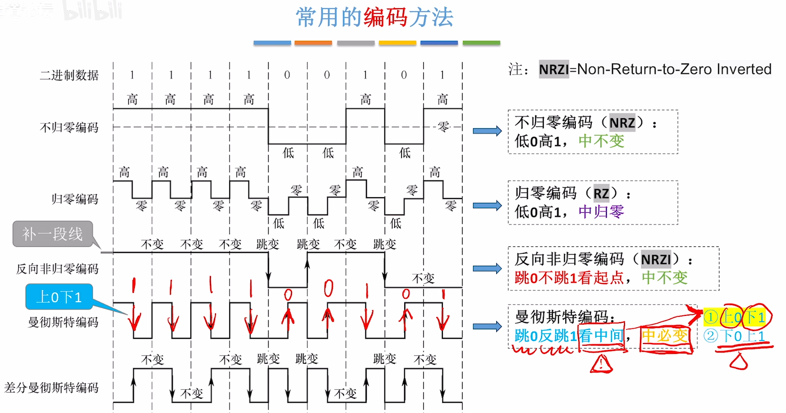

# 计算机网络

### 概念

计算机网络(Computer networking)是一个将众多**分散的**，**自治的**计算机系统，通过通信设备与线路连接起来，由功能完善的软件实现**资源共享**和**信息传递**的系统

计算机网络(简称网络)：由若干节点（node）和连接这些节点的线路（link）组成，节点可以使计算机，集线器，交换机，路由器等

集线器（hub）：可以把多个节点连接起来，组成一个计算机网络。普通民用领域已经很少使用集线器，工作在**物理层**。总线拓扑型以广播方式通信，同一时刻仅两个端口通信，半双工传输

交换机（switch）：可以将多个节点连接起来，组成计算机网络，家庭、公司、学习常用交换机组建内部网络，工作在**数据链路层**，通道相互独立全双工通信

路由器（router）：可以把两个或多个计算机网络互相连接起来，形成规模更大的计算机网络“互连网”，工作在**网络层**

家用路由器和传统路由器有一定区别，家用路由器=路由器+交换机+其他功能

ISP ：Internet Service Provider,即**互联网服务提供商**

互连网（因特网），由各大ISP和国际机构组件的，覆盖全球范围的互连网（internet）

小写字母开头的internet（互连网）是个通用名词，泛指多个计算机网络互连而成的计算机网络，对网络间的协议没有要求。

大写字母开头的（互联网）是个专有名词，指全球范围的众多网络互连而成的特定的互连网，它采用TCP/IP协议族。

### 计网的组成和功能
每个网络内部可能使用：集线器、交换机、路由器、调制解调器、无线基站、网线、光纤等各种设备或线路。

​	 - 主机（端系统、end system）电脑、手机、物联网设备

硬件  - 通信设备 集线器、交换机、路由器

​	 - 通信链路 网线、光纤、同轴电缆

软件  - 方便用户使用，实现资源共享。如：Email客户端、聊天软件、网盘软件

协议  - 规定计算机网络中的通信规则 

​	 - 由硬件、软件共同实现  网络适配器+软件 实现网络通信协议

硬件内部安装网络适配器（网卡），网卡再配合软件协议实现网络通信协议。网卡负责交换主机和网络的数据

无线网络适配器通常集成在主板上

从工作方式看，计算机网络主要分为**边缘部分**与**核心部分**.核心部分实现网络连通性与资源交换服务，边缘部分则是各种用户设备，例如服务器与主机。交换服务的核心是路由器

从逻辑功能看，主要分为**资源子网**与**通信子网**
资源子网：计算机网络中运行应用程序，向用户提供可共享的硬件、软件和信息资源的部分。主要由连接到互联网上的主机组成
通信子网：负责信息传输的部分，即所有互联的通信设备与介质的总称，主要由通信链路+通信设备+协议构成。*主机内部实现信息传输的网络适配器、底层协议属于通信子网的范畴*

功能上主要为：**数据通信**，资源共享，分布式处理，提高可靠性，负载均衡，其他（生活，娱乐）

### 交换
交换技术：**电路 报文 分组**，分别对应电话网络，电报网络，现代计算机网络
电路交换(Circuit Switching)：通过物理线路的连接，**动态分配**传输线路资源，**专用**物理链路，**始终**占用端到端线路资源，数据直送，传输效率**高**适合*低频次连接，大量传输数据*。
缺点：
- 建立/释放连接需要**额外的时间开销**。
- 线路被通信双方**独占**，**利用率低**。
- 线路分配的**灵活性差**。交换节点**不支持“差错控制”**（无法发现传输过程中发生的数据错误）

报文交换：
报文存储在交换设备内存中，交换设备内建路径表，优先选择通路。报文附带发送方和接收方信息
优点：
- 通信前**无需建立连接**，仅需要将文件上传至报文网络
- 数据以“报文”为单位在被交换节点间“**存储转发**”，通信线路可以**灵活分配**
- 在通信时间内，两个用户**无需独占**一整条物理线路。相比于电路交换，**线路利用率高**
- 交换节点**支持“差错控制”**（通过校验技术）

缺点：
- 报文**不定长**，不方便存储转发管理
- 长报文的存储转发**时间开销大、缓存开销大**
- 长报文容易出错，重传**代价高**

分组交换：
将不定长的报文转换为定长的分组，在每一段分组中加入相同的header控制信息（源、地址、目的地址、分组号等）。
报文（Message），分组、包（Packet），首部、头信息（Header）.
优点：
- 通信前无需建立连接
- 以“分组”为单位在被交换节点中“存储转发”，通信线路可以灵活分配
- 在通信时间中，两个用户无需独占一整条物理线路。相比于电路交换，线路利用率高。
- 交换节点支持“差错控制”（通过校验技术）

改进：
- 分组**定长，方便存储转发管理**
- 分组的存储转发时间开销小、缓存开销小
- 分组不易出错，重传代价低

缺点：
- 相比于报文交换，控制信息占比增加
- 相比于电路交换，依旧存在存储转发时延
- 报文被拆分为多个分组，传输过程中可能出现**失序、丢失等**问题，增加处理的复杂度

#### 虚电路交换技术
**虚拟电路**，所以会先建立连接，然后通信，分组按序从既定的线路发送，通信双方不独占线路，释放连接

### 类型
分布范围分类：广(Wide Area Network) 城(Metropolitan Area Network) 局(Local Area Network) 个(Personal Area Network)
传输技术分类：广播式网络 点对点网络
拓扑结构分类：[总线 环形 星形]常见于局域网 网状
按使用者分类：公用网 专用网
传输介质分类：有线网络 无线网络
城域网和广域网通常采用以太网技术，个域网通常是通过无线技术连接的网络，因此常称为无线个域网。局域网几乎都是采用**以太网**技术，平时所说的基本也都是以太网交换机
广播式网络发送数据分组时，广播范围内所有计算机都会收到该分组，并通过检查分组目的地址决定是否接受该分组，点对点(p2p)网络则精准送达
总线结构数据广播式传播，存在总线占用的问题
集线器时期主要使用令牌环网技术，以太网交换机发明后以太网技术取得统治地位

### 计网性能指标
- 速率、带宽、吞吐量
- 时延、时延带宽积、往返时延
- 信道利用率
**信道**（Channel）：表示向某一方向传送信息的通道（信道!=通信线路），一条通信线路在逻辑上往往对应一条**发送信道**和一条**接收信道**
**速率**（Speed）：指连接到网络上的节点在信道上传输数据的速率，也称**数据率**或**比特率**、**数据传输速率**
速率单位：bit/s，或b/s，或bps（bit per second）;小b比特，大B字节，1B=8b , 1MB/s = 8Mbps
数量前缀：k（千）M（兆）G（吉）T（太），传输速率是$10^3$为单位递增，大小是1024
带宽（bandwidth）：某信道所能传送的最高数据率,传输时遵循**木桶效应**，速率最低的一方决定了双方传输速度的上限
在《计算机网络》中：带宽（bandwidth）表示信道所能通过的“最高数据率”。在《通信原理》中：带宽表示某信道允许通过的信号频带范围。单位Hz赫兹，可以加上数量前缀k、M、G、T
光纤的带宽约500Mhz，电话线的带宽约3kHz
吞吐量（Throughput）：指单位时间内通过某个网络（或信道、接口）的实际数据量（**实际的综合数据率**），吞吐量受带宽限制、受复杂的网络负载情况影响
点对点传输：**网线吞吐量=信道吞吐量总和=网卡吞吐量**

#### 时延
时延（Delay）：指数据（一个报文或分组，甚至比特）从网络（或链路）的一端传送到另一端所需的时间，有时也称为延迟或迟延
总时延 = 发送时延 + 传播时延 + 处理时延 + 排队时延
发送时延又称作传输时延，指节点将数据推向信道所花的时间，发送时延=数据长度(bit)/发送速率(bit/s)
传播时延指电磁波在信道中传播一定距离所花的时间，传播时延=信道长度(m)/传播速度(m/s)
处理时延和排队时延指从数据**排队进入**路由器**被路由器处理**所花的时间（分析首部、查找存储转发表）到**排队发出**所花的时间
**时延带宽积**=传播时延\*带宽 = (bit/s)
含义：一条链路中**从发送端发出但尚未到达接收端**的最大比特数，可以理解为求水管容积

#### 往返时延

往返时延RTT（Round-Trip time）：表示从发送方发送完数据，大批发送方收到来自接收方的确认总共经历的时间

#### 信道利用率

指某个信道有百分之多少的时间是有数据通过的（使用时间/总时间），利用率太低浪费资源，利用率过高容易网络堵塞

### 计算机网络的分层结构

这些结构需要完成：差错控制、流量控制、分段和重装、复用和分用、连接建立和释放
被复用的主要功能：**差错控制，流量控制，连接管理，可靠传输管理**

由浅到深可简单分为物理层、数据链路层、网络层、传输层、应用层 ；交换设备主要负责主机和主机之间的物理层、数据链路层和网络层，建立起连接后由主机与主机处理传输层和应用层。**分层结构的设计并不唯一**，可以根据实际需求增加或减少层次。**同一个功能可以在不同层次中反复出现**。

OSI参考模型为7层（法律上的标准）：

- 应用层
- 表示层
- 会话层
- 传输层
- 网络层
- 数据链路层(会给信息加上头尾）
- 物理层  

对于实际标准TCP/IP 模型，仅有四层：应用层（包含应用、表示和会话） 传输层 **网际层** 网络接口层（包含数据链路层和物理层）
教学用标准模型为五层：应用层（包含应用、表示和会话） 传输层 网络层 数据链路层 物理层

网际层并不在OSI标准模型中，他负责的主要是**不同网络之间的通信**，这主要也是TCP/IP主要负责的功能 
 
计算机网络的体系结构（Network Architecture）事实上是计算机网络各层及其协议的**集合**。就是这个计算机网络及其构建所应完成的**功能的精准定义**（不设计实现）
实现（implement）是遵循这种体系结构的前提下，用何种硬件或软件完成这些功能的问题。
体系结构很**抽象**，但实现则是**具体**的
**实体**：在计算机网络的分层结构中，第n层中的活动元素（硬件+软件）通常称为第n层实体，不同机器上的同一层称为***对等层***，同一层的实体称为***对等实体***。
**协议**，即 网络协议（Network Protocol），是控制对等实体之间进行通信的规则的集合，是水平的
**接口**：即同一节点内***相邻两层的实体***交换信息的逻辑接口，又称为**服务访问点**（Service Access Point，SAP）
**服务**：服务是指***下层为紧邻的上层***提供的功能调用，它是垂直的。（应用层为传输层提供应用服务，这是可能对的吗？）
：网络结构内每一层都可以认为是**实体**，**相邻两层**通过逻辑**接口**进行信息交换，下层通过服务为**相邻上层**提供功能调用
不同类型的节点，实现功能的方式可能不一样

从逻辑层面看，数据传输过程从自己的主机 应用层>传输层>网络层>数据链路层>物理层 由此离开主机进入传输介质通向路由器，再到另一方的电脑上过程反向还原。
数据的压缩一般是**YSCS协议**，发送方将数据压缩后{应用层功能}，需要增添首部（head），标识采用的压缩算法；接收方根据标识信息选择解压缩算法将数据解压。
首部的大小、具体格式需要在协议中明确规定。

协议数据单元（PDU）：对等层次之间传送的数据单位
服务数据单元（SDU）：为完成上一层实体所要求的功能而传输的数据
协议控制信息（PCI）：控制协议操作的信息
上述都可以记为n-XXX，标识第几层的XXX（PDU/SDU/PCI)
三者的关系为**n-SDU + n-PDU = n-PDU = (n-1)-SDU**协议控制信息+协议数据单元=该层务数据单元=下一层的服务数据单元；或该层的协议数据单元=上一层传递的服务数据单元+本层的协议控制信息.

#### OSI参考模型详述

物理层的任务是实现相邻节点间比特传输，需要**定义接口参数和传输信号的含义/电气特征等**，物理传输媒体（光线等）算第0层，可以认为物理层是调制解调器这类

数据链路层确保相邻节点之间的链路逻辑上无差错，包含有：差错控制，流量控制。链路层之间的传输单位是帧。通过添加与检验头文件来控制差错，协调流量传输速率是为了照顾双方设备（木桶效应）。**点到点通信**

网络层把“分组”从源节点转发到目的节点。在该层，传输的单位是**分组（packet）**，又称数据报。包含以下功能：
- **路由选择**：构造并维护路由表，决定分组到达目的节点的最佳路径
- 分组转发：将“分组”从合适的端口转发出去
- 拥塞控制：发现网络拥塞，并采取措施缓解拥塞
- 网际互联：实现异构网络互联
- *差错控制、流量控制、连接的建立与释放（确保分组到达有序和不重复）、可靠传输管理（接收方需返回分组确认消息）*

传输层：实现**端到端通信，即进程到进程的通信**，端指端口。进程占用不同的端口号，要求网络层的服务，向另一个主机的端口通信，在这一层的传输单位为报文
- **复用和分用**：发送端几个高层实体复用一条低层的连接，在接收端再进行分用
- *差错控制、流量控制、连接的建立与释放、可靠传输管理（**都以报文为单位**）*

会话层：进程间的会话管理，拥有类似断点续传的机制，通信失效时从检查点恢复通信
表示层：解决不同主机上信息表示不一致的问题，主要是数据格式转换（编码，解压缩）
应用层：实现特定的网络应用，根据实际需求设计

#### TCP参考模型详述
这个模型只有四层：应用层 传输层 网络层 网络接口层。应用层包含了应用，表示，会话层的功能。网络接口层包含了物理层和数据链路层。
因为并不是所有网络应用都需要数据格式转换和会话管理功能，TCP/IP模型中没有表示层和会话层。如果某些应用**需要使用这两种功能，可以交给应用层的特定协议去使用**。
对于**网络接口层**，TCP/IP协议认为，网络硬件种类繁多，不应该过多的限制主机到网络设备之间的连接方式，所以并不参照传统的OSI模型。TCP/IP只考虑任务是否实现，怎么传输不作规定。所以**TCP/IP具有更强的灵活性与适应性**。
TCP /IP的网络层功能相对简单，并、**不进行差错控制和流量控制**，只是负责交付数据而已，传输层负责网络层原有的功能
#### 常见网络设备功能层次
- 集线器：物理层
- 交换机：物理层 数据链路层
- 路由器：物理层 数据链路层 网络层

#### 传输单位
比特流（物理层）< 帧(Frame) < 分组(Packet) < 报文段(Segment) < 报文(Message)
报文不定长，多个报文段组成报文

### 协议
即网络协议，是水平的，由**语法、语义和同步**三要素组成；语法：数据与控制信息的格式、语义：需要发出何种控制信息，完成何种动作和做出何种回答、同步：通信双方的操作条件，**时序**关系等

## 通信基础
也就相当于**物理层**的详述了
信源：信号的来源，数据的发送方。信宿：信号的接收方。
**数字信号：信号值是离散的  模拟信号：信号值是连续的**，每一个信号为一个**码元**，信号周期可以称为**码元宽度**
若规定电压1为1，-1为0，则在一个信号周期内可能出现两种信号，此时可以认为一个码元携带了一个bit位的数据，也叫**2进制码元**，有几种状态就叫多少进制码元
如果增添更多电压所对应的数据信息，则可以使每个“信号周期”传输更多信息，但相应的需要加强信号功率，同时也提升了对信道的要求
如果一个周期内可能出现k种信号（k进制码元），则**1个码元携带=log₂K bit**
波特率：每秒传输几个码元，单位是码元/秒或波特(Baud)
比特率：每秒传输几个比特，单位是bit/s, b/s, bps
波特率和码元的互换需要具体数值，波特率\*(码元携带的比特数)=比特率
换成数学式则：若一个码元携带n比特数据量，则波特率 M Baud 对应的比特率为 Mn b/s

计网中带宽（bandwidth）表示信道能通过的**最高数据率**，通信原理中表示**允许通过的信号频带范围**，本质上描述的都是**信道传输数据能力的大小**

#### 噪声
对信道产生干扰，影响信道的数据传输效率。例如强电压，电磁场之类。
##### 奈奎斯特定理：
对于一个**理想低通信道**（无噪声、带宽有限的信道）
极限波特率=2W （单位：波特，即 码元/秒）
W是信道的频率带宽（单位：Hz）
极限比特率=2W log₂K b/s

如果波特率太高，会导致“码间串扰”，即接收方无法识别码元；带宽越大，信道传输码元的能力越强；该定理并未对一个码元可以携带多少比特做出解释

##### 香农定理
对于一个有**噪声、带宽有限**的信道
极限比特率= Wlog₂(1+S/N) b/s    **S/N=信噪比=信号的功率/噪声的功率**；无单位记法下信噪比数字会非常大，采用分贝记法时，信噪比=10log₁₀S/N dB

使用香农定理**计算**信道的极限比特率时，**“信噪比”应采用“无单位记法”**

提升信道带宽、加强信号功率、降低噪声功率，都可以提高信道的极限比特率
结合奈奎斯特定理可知，在带宽、信噪比确定的信道上，一个码元可以携带的比特数是有上限的。

### 编码与调制
#### 概念
二进制数据通过编码为数字信号，再调制成模拟信号
反向则是解调与解码，光猫（调制解调器）可以将二进制数值调制成在光纤中传输的光信号。

#### 常用编码方法
非归零编码(NRZ)：高低电位，单时间周期单信号
归零编码(RZ)：高低电位，单时间周期双信号（第二个信号位归零）
反向非归零编码(NRZI)：1不变0跳变，单时间周期单信号
曼彻斯特编码：高低电位，单时间周期双信号
差分曼彻斯特编码：高低电位，单时间周期双信号

非归零编码没有传递周期信息，当传输时间过长后会产生偏差，所以后续的编码方法采取归零的方式作为周期特征。
曼彻斯特编码看中间，如果一个周期内信号电压差是 下跳 从高到低为1，上跳 从低到高为0。差分曼彻斯特编码看起点，传输1时不跳变（高低高低高低），0跳变

非归零编码：无自同步能力，不浪费带宽，弱抗干扰
归零编码：有自同步能力，浪费带宽，弱抗干扰
反向非归零编码：增加冗余位可支持自同步（一般每8个比特位增加一个冗余位），浪费一点宽带，弱抗干扰能力
曼彻斯特编码：有自同步能力，浪费宽带，强抗干扰能力。
差分曼彻斯特编码：有自同步能力，浪费宽带，强抗干扰能力

#### 常用的调制方法
假设一个信号周期为4π毫秒，记信号值为y，时间为x
**调幅**(AM)
幅度以sin2x进行调制，0\*sin2x幅度表0（无波幅）,1\*sin2x幅度表示1（有波幅）
**调频**(FM)
正弦波频率，sinx表示0，sin2x表示1
**调相**(PM)
sin（x+0）表0
sin（x+π）表1
**正交幅度调制**(QAM)
结合了调幅与调相，使得同时具有幅值和相位的属性，可以调出幅值\*相位种信号，则此时1码元=log₂mn bit

### 传输介质
常用的传输介质分为导向型（双绞线、同轴电缆、光纤）与非导向型（无线传输介质）
物理层接口的特质
双绞线主要由两根导线相互绞合而成，分为屏蔽双绞线(STP)和非屏蔽双绞线(UTP)；抗干扰能力较好。绞合、屏蔽层可以提升电磁抗干扰能力；代表应用为近年局域网、早期电话线；线结构由外到内一般为聚氯乙烯套层>[屏蔽层]>绝缘层>铜线组成
同轴电缆主要由**内导体（传输信号）+外导体屏蔽层（用于抗电磁干扰）**构成；抗干扰能力强，代表应用是早期局域网和早期有线电视；线结构由外到内一般为绝缘保护套层>外导体屏蔽层>绝缘层>内导体，内导体越粗，电阻最低，传输过程中信号衰减越少，传输距离越长
光纤主要由纤芯（高折射率）+包层（低折射率）构成，利用光的**全反射**特性在纤芯内传输光脉冲信号；分类分为单模光纤与多模光纤，单模光纤只有一条光线在一根光纤中传输，适合**长距离**传输，信号传输损耗小。多模光纤有多条光线在一根光纤中传输，适合**近距离**传输，远距离传输光信号容易失真；抗干扰能力非常好，光信号对电磁干扰不敏感；信号传输损耗小，长距离传输时中继器少，线细很省布线空间；线结构由外到内为包层>纤芯

#### 以太网对有线传输介质的命名规则
速度+Base+介质信息
10Base5  --10Mbps,同轴电缆，最远传输距离500m
10Base2  --10Mbps,同轴电缆，最远传输距离200m(实际185m)
10BaseF* --10Mbps,光纤，\*可以是其他信息，例如10BaseT1S,10BaseT1L
1000BaseT1 --1000Mbps,双绞线
2.5GBaseT  --2.5Gbps，双绞线

无线传输介质：
无线电波；穿透能力强，传输距离强，信号指向性弱
微波通信；频率带宽高、信号指向性强、保密性差（容易被窃听）
卫星通信：卫星作为信号中继器，传播时延较大
其他：红外线通信，激光通信等信号指向性就比较强了
频率越高，数据传输能力越强。波长越短，“信号指向性”越强，信号越趋于直线传播。波长越长，绕射性（穿墙）能力越强。长波适合长距离非直线通信，短波更适合短距离高速通信。

物理层接口特性：
机械特性：指明接口所用的接线器形状和尺寸、引脚数目和排列、固定和锁定装置等
电气特性：指明接口电缆各条线上出现电压的范围、传输速率、距离限制等
功能特性：指明某条线上出现的某一电平的电压的意义
过程特性：指明对不同功能的各种可能事件出现的顺序 （例插拔网线的结果）

### 物理设备
集线器、中继器并不能**无线串联**，例10Base5的5-4-3原则。使用集线器/中继器连接10Base5网段时，最多只能串取5个网段，使用4台集线/中继设备，只有3个网段可以挂接计算机
#### 中继器
中继器（Repeater），会将信号重新整形后再输出（整形再生）。例如物理层规定0.5-1.5v是低电平，4.5-5.5v是高电平，如果中继器收到信号不符合这个标准，则将低电平整形为1v，高电平整形为5v再输出，会产生一点时延
仅支持半双工通信（两端节点不可同时发送数据），中继器的两个端口对应两个网段

#### 集线器
本质上是多端口中继器，各端口连接的节点不可同时发送数据，会**冲突**。集线器的N个端口对应“N”个网段，属于同一个**冲突域**。集线器的所有网段**共享带宽**，如果连接了速率不同的网段，速率将会**向下兼容**。集线器可以连接不同的传输介质，所以**物理层协议**可以不同（**但是国内教材认为不可**）

### 数据链路层
数据链路层使用物理层的“**比特传输**”服务，数据链路层为网络层提供服务，并将网络层的IP数据报（分组）封装成**帧**，传输给下一个相邻节点的**对等实体**。物理链路：传输介质（0层）+物理层（1层）实现了相邻节点之间的“物理链路”。
数据链路层功能：**封装、差错控制、可靠传输、流量控制、介质访问控制**（广播信道需要实现此功能。广播信道在逻辑上是总线型拓扑，多个节点争抢传输介质使用权）
组帧：
- 主要问题：帧定界、透明传输
- 四种组帧方法：字符计数法，字节填充法、零比特填充法、违规编码法
字符计数法：在每个帧开头用一个**定长计数字段**表示帧长（=计数字段长度+帧数据长度）；一旦计数字段出错，后续无法定界
字节填充法：在首尾添加字节对应控制字符(01H,04H)，含义SOH（start of header） EOT(end of transmission),如果一段帧中数据刚好包含了控制字符，也不要紧，会在这一段数据前增添转义字符；冗长
零比特填充法：以一段特殊字符串作为开始和结束（01111110），会面临和字节填充法一样的问题，所以**发送方**需要对帧进行处理，**每遇到连续的5个1，就填充1个0**，**接收方**则是**每当遇到5个连续的1，删去后方的0**
***HDLC和PPP协议使用零比特填充法***
违规编码法：基于**曼彻斯特编码**，上跳0下跳1，如果周期中间不跳变则“违规”。简而言之，就是帧的首尾将会使用**违规编码**不进行跳变，以此区分边界，需要物理层的配合

#### 差错控制
目标是发现并解决帧内部的“**位错**”，方案1是丢弃并通知发送方重传（检错编码：奇偶校验码，CRC校验码），方案2是由接收方纠正比特错误（纠错编码：海明校验码）

##### 奇偶校验
奇偶校验：异或运算
奇校验码：整个校验码（有效信息位和校验位中的1个数为奇数）
偶校验码：整个校验码（有效信息位和校验位中的1个数为偶数）
设最高位为校验位，余7位为信息位，则编码1001101对应的奇偶校验码分别为：11001101,01001101;因为偶校验可以通过硬件实现，所以**更常用偶校验码**，各信息进行异或（模2加）运算，得到的结果为偶校验位（所有位进行异或，结果为1则出错）;**当出现偶数位的比特错误时，无法成功校验**（出现2/4/6个比特位错误）,**无纠错能力**

##### 循环冗余校验码
发送方和接收方约定一个**除数**，k个信息位+r个校验位作为“**被除数**”，添加校验位后需要保证除法的余数为0，收到数据后若余数非0则说明出错，进行重传或纠错
这里的除法比较麻烦，所使用为模二除法产生余数。确定K、R时，k=信息码长度，R=生成多项式最高次幂，校验码位数N=K+R，运算前需将信息码左移R位
循环冗余校验码有一定纠错能力，具体可直接获知的出错位为R比特位所能表示的余数，例如R=3时，可以表示8个比特位的信息。
![[循环冗余码2.png]]
![[循环冗余码.png]]

##### 海明码
基于偶校验延伸，将信息位分组进行偶校验->多个校验位->多个校验位标注出错位置
信息位+校验位共n+k位，有$2^k$种状态，n+k中任何一位都可能出错，状态数应当>=n+k+1（可表示的状态数大于所有可能出错的位+1种正确状态），具有一位的纠错能力和两位的检错能力
![[海明码.png]]
在海明码中，校验位不能放在头尾，而是混入比特流中2^(i-1)的位置
![[海明码2.png]]

### 滑动窗口机制
由接收方控制发送方的发送窗口滑动，如果发送的数据大于接收窗口所接受的数据，多出的数据将会直接丢弃
![[滑动窗口.png]]
![[利用率公式.png]]
#### 停止-等待协议
**S**-**W**
发送窗口=接收窗口=1；若接收方收到i号帧，且未检测出“差错”，需要给发送方**返回确认帧ACK_i**，若发送方**超时未收到ACK_i，则重传i号帧**,帧的编号都遵守W(T)+W(R)<=$2^n$
基本是就是一传一确认。因为双工通信的缘故，所以相互传输的数据会加上首尾来辨认传输的是数据帧还是确认帧。**仅需1bit用于帧编号**

#### 后退N帧协议
**GBN**
发送窗口W(T)>1，接收窗口W(R)=1。确认帧ACK_i,会超时重传；帧的编号都遵守W(T)+W(R)=$2^n$；关于确认帧，接收方可以“积累确认”。连续收到多个数据帧时，**仅返回最后一个帧的ACK**。当收到接收窗口之外的帧时，返回目前最后正确接受的帧的ACK。在接收方接收数据慢，或者信道误码率高的情况下，需要经常回退，传输效率低下

#### 选择重传协议 
**SR**
发送窗口>1,接收窗口>1若接收方收到i号帧，但是有差错，则丢弃该帧返回否认帧NAK_i。若发送方收到NAK_i，则重传i号帧。接收窗口<=发送窗口。当NAK_i否认帧传输后，不需要等待计时器，可以立即使发送方进行重传。这里只要是连续的、正确的帧，接收窗口就会移动到连续正确的最后一个帧后。**不可累计确认，一帧一确认**。

### 介质访问控制
#### 信道划分
时分复用(TDM)：将时间分为等长的(TDM)帧，每个帧又分为等长的m个“时隙”，将m个时隙分配给m对用户（节点）使用。每个节点在一轮时间周期（帧）中可用信道的时间为1/m，如果某节点暂时不发送数据，时隙闲置，则信道利用率就低了。
统计时分复用(STDM) ：统计各个节点在一段时间内的信道使用需求，动态的按需分配时序。也可以认为是对每个用户可使用的时隙进行了不同的加权。
频分复用(FDM)：将信道的总频带划分为多个子频带，每对用户使用一个子频带（信道）进行通信；充分利用了信道带宽（hz），但是只能用于模拟信号的传输
波分复用(WDM)：本质上是光信号的频分复用，光信号的频带范围大，很适合使用波分复用技术
码分复用(CDM)：当多个端向同一个端发送数据时，接收端会收到叠加信号值。可以通过不同的码分序列进行还原，剥离出来自不同发送端的数据信息。关键在于**码分序列**和**规格化内积**。m的取值看有几维。

#### 随机访问
CSMA/CD 用于早期有线以太网(总线型)
CSMA/CA 用于IEEE 802.11  无线局域网 (WIFI)
#### ALOHA协议
纯ALOHA协议：准备好数据帧就立刻发送。如果确认帧超时则随机等一段时间后重传。信道利用率很随机，可能出现两端数据不停冲突的情况。
时隙ALOHA协议：时隙大小固定=传输一个最长帧所需时间，只有在每个时隙开始时才能发送帧；避免了用户发送数据的随意性，降低了冲突概率，提高了信道利用率。

#### CSMA协议
即载波**监听**多路访问(Carrier Sense Multiple Access)协议，在**ALOHA**协议的基础上进行改进
非坚持CSMA协议：在发送数据之前，先监听信道是否空闲，只有信道空闲时，才会尝试发送。节点的网络适配器安装“**载波监听装置**”,信道如果不空闲，则放弃监听信道，过一段时间再尝试。缺点是信道刚恢复空闲时并不会被立刻利用，导致信道利用率降低
坚持CSMA协议：坚持监听，如果空闲，则有概率立即把数据帧发送出去，也可能推迟一段时间再发送，如果不空闲则再坚持监听

**1**坚持CSMA协议：如果空闲则立刻发送数据。
演变为CSMA/CD
CSMA/CD协议（载波监听多路访问/冲突检测协议）：经常用于早期的**总线**以太网，现在的有线局域网也使用“以太网技术”，但不一定都是“总线型”。先听后发（空闲立即发），边听边发，**冲突停发，随机重发**.如果冲突次数小于10，则在(0, 2^k-1)中随机取一个整数r（随机等待的时间=r倍争用期）。如果次数大于10则k=10。当次数达到**16**时，**放弃**并报告网络层.该协议**没有ack帧**，发送过程未冲突则默认成功。争用期为最大传播时延\*2，最短帧长为2\*最大单选传播时延\*信道带宽，若收到的帧小于最短帧长则视为无效。***以太网规定：最短64B，最长1518B***。因为有最小帧长限制，所以当发送的数据产生冲突，但发送出去的帧很短时，可能会导致a节点误认为未冲突。所以如果实际要发送的数据很少，可***填充***至最短帧长再发送。**最长帧长**可以防止某些节点一直占用信道。
如果不填充最短帧，则若a发送的一小段数据在b发送后一刻到达，此时冲突，b节点抛弃了数据，但是b节点发送的数据在到达a节点时a节点**已经完成了**传输，则a节点会认为数据已经完整传输完毕，未发生冲突

CSMA/CA(载波监听多路访问/冲突避免)：用于IEEE 802.11 无线局域网 WIFI。发送前进行监听，空闲则发送**但不检测冲突**，所以发送前要尽量避免冲突。

#### 轮询访问
令牌环网技术，环形拓扑，各节点轮询访问信道，令牌传递。数据帧会在环网中绕一圈，接受者会将数据帧的接收状态改为true（CRC通过），数据帧回到发送端后则会被发送端转为令牌帧，交给下一顺位的主机。如果无数据发送，则再次更新令牌号传递给下一顺位主机。如果数据有误会重发，令牌不释放。数据帧需指明源地址/目的地址、是否被接受、获得令牌的节点编号。

### 局域网
以太网与IEEE 802.3
同轴电缆以太网(10BaseT)：80年代后期发展出双绞线以太网(10BaseF)；90年代初发展出光纤以太网
光纤以太网：点对点，光纤，用两条光纤实现全双工通信
集线器**物理上是星型，逻辑上是总线型**，半双工
交换机逻辑和物理上**都是星型**
早期网线仅有一对双绞线（半双工通信）；现在网线**一般**是4队双绞线，全双工通信
局域网(LAN)：范围小，时延与误码率低，各节点之间以“帧”为单位进行传播，支持单播、广播、多播。
无线局域网(WLAN):星型，CSMA/CA协议。
AP(Access Point)无线接入点
家用路由器= 路由器+交换机+其他
校园网=路由器+n个交换机+n\*m个AP
***网络适配器***的ROM（只读存储器）中写入了设备MAC地址，同时还有一块RAM（随机存取存储器）用以帧数据缓冲；曼彻斯特编码，串行通信。
***无线网络适配器***也有ROM，RAM，内置WIFI天线，用以电磁波与模拟信号的转换。网络层IP地址会产生变化，[无线]网卡收到的数据报或封装好的帧进入主存（网卡走I/O总线）

### 以太网与IEEE 802.3
以太网标准：同轴电缆仅半双工，双绞线速率<2.5Gbps半或全，大于仅全。光纤仅全双工。半双工下使用CSMA/CD协议
![[v2标准帧.png]]
![[v2标准帧2.png]]

#### VLAN（虚拟局域网）
可将一个大型局域网分为若干个较小的VLAN，每个VLAN是一个广播域
每个广播域对应一个VID（VLAN ID），可以解决安全性等问题。交换机内的数据结构会记录VID和接口号之间的映射关系。
VLAN的划分方式有三种：基于**接口**、基于**MAC**地址、基于**IP**地址。基于接口则无法进行实时改变，接口所对应的VID是固定的；基于MAC地址时，接口可以随便插，因为已经对MAC地址所对应的VID进行了绑定；基于IP地址时，需要网络层功能的支持，可以使多个局域网的主机组成同一个VLAN
交换机与交换机之间可以进行干线链路链接，一般是最后一个接口对应另一个交换机的一号接口。对于路由器来说，每一个接口对应一个不同的子网（局域网），但是基于IP地址划分则可跨网划分虚拟局域网（hamachi，蒲公英）。
如果帧的传递跨越交换机，则需指明VID。主机与交换机之间传输标准以太网帧，但交换机与交换机之间传输则为802.1Q帧，在源地址与类型之间加入了VLAN标签，其中含有标签类型（1000001 0000000）与标签控制信息（4位+12位VID）
![[802.1Q.png]]

### 802.11无线局域网的基本概念
无线局域网属于星型拓扑，中心称为**接入点（AP）**，也可称为无线接入点（WAP）
基本服务集：1个基站+多个移动站（一个热点和多台设备）
    服务集标识符（SSID)：无线局域网名，不超过32个字节
     基本服务区BSA：一个基本服务集能覆盖的地理范围（WiFi覆盖范围）
门户（Portal）可将802.11无线局域网接入802.3有线以太网
扩展服务集ESS：将多个AP连接到同一个分配系统，组成一个更大的服务集：WIFI中继（中继属于同一个子网，桥接属于不同子网）
漫游：一个移动站从一个基本服务集切换到另一个基本服务集仍可保持通信（不同基站切换）
#### 802.11帧的分类
1. 数据帧
2. 控制帧：ACK、RTS（请求发送）、CTS（允许发送）帧
3. 管理帧：探测请求/探测响应帧（关闭热点可见性后不返回响应帧）
![[802.11数据帧格式.png]]
设备发送端发送数据时，地址1/2/3分别对应中转节点（AP）/发送设备/接收设备。接收端接受来自AP的数据时，此时为接收设备/中转节点/发送设备。
802.11帧用于无线链路传输，通常是AP与移动站之间的传输。在有线链路上通常使用以太网帧格式，AP与AP、AP与路由器、AP与以太网交换机之间使用有线链路。AP通常具备帧格式转换功能

### 广域网
没什么事，主要涉及ppp协议