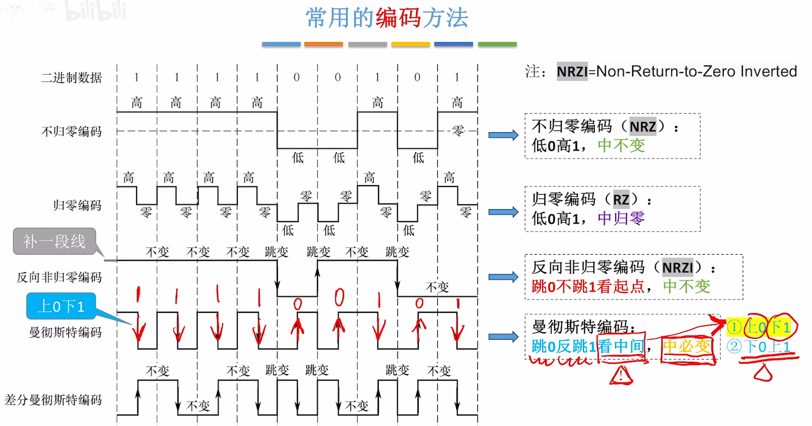

# 计算机网络

### 概念

计算机网络(Computer networking)是一个将众多**分散的**，**自治的**计算机系统，通过通信设备与线路连接起来，由功能完善的软件实现**资源共享**和**信息传递**的系统

计算机网络(简称网络)：由若干节点（node）和连接这些节点的线路（link）组成，节点可以使计算机，集线器，交换机，路由器等

集线器（hub）：可以把多个节点连接起来，组成一个计算机网络。普通民用领域已经很少使用集线器，工作在**物理层**。总线拓扑型以广播方式通信，同一时刻仅两个端口通信，半双工传输

交换机（switch）：可以将多个节点连接起来，组成计算机网络，家庭、公司、学习常用交换机组建内部网络，工作在**数据链路层**，通道相互独立全双工通信

路由器（router）：可以把两个或多个计算机网络互相连接起来，形成规模更大的计算机网络“互连网”，工作在**网络层**

家用路由器和传统路由器有一定区别，家用路由器=路由器+交换机+其他功能

ISP ：Internet Service Provider,即**互联网服务提供商**

互连网（因特网），由各大ISP和国际机构组件的，覆盖全球范围的互连网（internet）

小写字母开头的internet（互连网）是个通用名词，泛指多个计算机网络互连而成的计算机网络，对网络间的协议没有要求。

大写字母开头的（互联网）是个专有名词，指全球范围的众多网络互连而成的特定的互连网，它采用TCP/IP协议族。

***比特流（物理层）< 帧(Frame) < 分组(Packet) < 报文段(Segment) < 报文(Message)***
### 计网的组成和功能
每个网络内部可能使用：集线器、交换机、路由器、调制解调器、无线基站、网线、光纤等各种设备或线路。

​	 - 主机（端系统、end system）电脑、手机、物联网设备

硬件  - 通信设备 集线器、交换机、路由器

​	 - 通信链路 网线、光纤、同轴电缆

软件  - 方便用户使用，实现资源共享。如：Email客户端、聊天软件、网盘软件

协议  - 规定计算机网络中的通信规则 

​	 - 由硬件、软件共同实现  网络适配器+软件 实现网络通信协议

硬件内部安装网络适配器（网卡），网卡再配合软件协议实现网络通信协议。网卡负责交换主机和网络的数据

无线网络适配器通常集成在主板上

从工作方式看，计算机网络主要分为**边缘部分**与**核心部分**.核心部分实现网络连通性与资源交换服务，边缘部分则是各种用户设备，例如服务器与主机。交换服务的核心是路由器

从逻辑功能看，主要分为**资源子网**与**通信子网**
资源子网：计算机网络中运行应用程序，向用户提供可共享的硬件、软件和信息资源的部分。主要由连接到互联网上的主机组成
通信子网：负责信息传输的部分，即所有互联的通信设备与介质的总称，主要由通信链路+通信设备+协议构成。*主机内部实现信息传输的网络适配器、底层协议属于通信子网的范畴*

功能上主要为：**数据通信**，资源共享，分布式处理，提高可靠性，负载均衡，其他（生活，娱乐）

### 交换
交换技术：**电路 报文 分组**，分别对应电话网络，电报网络，现代计算机网络
电路交换(Circuit Switching)：通过物理线路的连接，**动态分配**传输线路资源，**专用**物理链路，**始终**占用端到端线路资源，数据直送，传输效率**高**适合*低频次连接，大量传输数据*。
缺点：
- 建立/释放连接需要**额外的时间开销**。
- 线路被通信双方**独占**，**利用率低**。
- 线路分配的**灵活性差**。交换节点**不支持“差错控制”**（无法发现传输过程中发生的数据错误）

报文交换：
报文存储在交换设备内存中，交换设备内建路径表，优先选择通路。报文附带发送方和接收方信息
优点：
- 通信前**无需建立连接**，仅需要将文件上传至报文网络
- 数据以“报文”为单位在被交换节点间“**存储转发**”，通信线路可以**灵活分配**
- 在通信时间内，两个用户**无需独占**一整条物理线路。相比于电路交换，**线路利用率高**
- 交换节点**支持“差错控制”**（通过校验技术）

缺点：
- 报文**不定长**，不方便存储转发管理
- 长报文的存储转发**时间开销大、缓存开销大**
- 长报文容易出错，重传**代价高**

分组交换：
将不定长的报文转换为定长的分组，在每一段分组中加入相同的header控制信息（源、地址、目的地址、分组号等）。
报文（Message），分组、包（Packet），首部、头信息（Header）.
优点：
- 通信前无需建立连接
- 以“分组”为单位在被交换节点中“存储转发”，通信线路可以灵活分配
- 在通信时间中，两个用户无需独占一整条物理线路。相比于电路交换，线路利用率高。
- 交换节点支持“差错控制”（通过校验技术）

改进：
- 分组**定长，方便存储转发管理**
- 分组的存储转发时间开销小、缓存开销小
- 分组不易出错，重传代价低

缺点：
- 相比于报文交换，控制信息占比增加
- 相比于电路交换，依旧存在存储转发时延
- 报文被拆分为多个分组，传输过程中可能出现**失序、丢失等**问题，增加处理的复杂度

#### 虚电路交换技术
**虚拟电路**，所以会先建立连接，然后通信，分组按序从既定的线路发送，通信双方不独占线路，释放连接

### 类型
分布范围分类：广(Wide Area Network) 城(Metropolitan Area Network) 局(Local Area Network) 个(Personal Area Network)
传输技术分类：广播式网络 点对点网络
拓扑结构分类：[总线 环形 星形]常见于局域网 网状
按使用者分类：公用网 专用网
传输介质分类：有线网络 无线网络
城域网和广域网通常采用以太网技术，个域网通常是通过无线技术连接的网络，因此常称为无线个域网。局域网几乎都是采用**以太网**技术，平时所说的基本也都是以太网交换机
广播式网络发送数据分组时，广播范围内所有计算机都会收到该分组，并通过检查分组目的地址决定是否接受该分组，点对点(p2p)网络则精准送达
总线结构数据广播式传播，存在总线占用的问题
集线器时期主要使用令牌环网技术，以太网交换机发明后以太网技术取得统治地位

### 计网性能指标
- 速率、带宽、吞吐量
- 时延、时延带宽积、往返时延
- 信道利用率
**信道**（Channel）：表示向某一方向传送信息的通道（信道!=通信线路），一条通信线路在逻辑上往往对应一条**发送信道**和一条**接收信道**
**速率**（Speed）：指连接到网络上的节点在信道上传输数据的速率，也称**数据率**或**比特率**、**数据传输速率**
速率单位：bit/s，或b/s，或bps（bit per second）;小b比特，大B字节，1B=8b , 1MB/s = 8Mbps
数量前缀：k（千）M（兆）G（吉）T（太），传输速率是$10^3$为单位递增，大小是1024
带宽（bandwidth）：某信道所能传送的最高数据率,传输时遵循**木桶效应**，速率最低的一方决定了双方传输速度的上限
在《计算机网络》中：带宽（bandwidth）表示**信道所能通过的“最高数据率”**。在《通信原理》中：带宽表示某信道允许通过的**信号频带范围**。单位Hz赫兹，可以加上数量前缀k、M、G、T
光纤的带宽约500Mhz，电话线的带宽约3kHz
吞吐量（Throughput）：指单位时间内通过某个网络（或信道、接口）的实际数据量（**实际的综合数据率**），吞吐量受带宽限制、受复杂的网络负载情况影响
点对点传输：**网线吞吐量=信道吞吐量总和=网卡吞吐量**

#### 时延
时延（Delay）：指数据（一个报文或分组，甚至比特）从网络（或链路）的一端传送到另一端所需的时间，有时也称为延迟或迟延
总时延 = 发送时延 + 传播时延 + 处理时延 + 排队时延
发送时延又称作传输时延，指节点将数据推向信道所花的时间，发送时延=数据长度(bit)/发送速率(bit/s)
传播时延指电磁波在信道中传播一定距离所花的时间，传播时延=信道长度(m)/传播速度(m/s)
处理时延和排队时延指从数据**排队进入**路由器**被路由器处理**所花的时间（分析首部、查找存储转发表）到**排队发出**所花的时间
**时延带宽积**=传播时延\*带宽 = (bit/s)
含义：一条链路中**从发送端发出但尚未到达接收端**的最大比特数，可以理解为求水管容积

#### 往返时延

往返时延RTT（Round-Trip time）：表示从发送方发送完数据，大批发送方收到来自接收方的确认总共经历的时间

#### 信道利用率

指某个信道有百分之多少的时间是有数据通过的（使用时间/总时间），利用率太低浪费资源，利用率过高容易网络堵塞

### 计算机网络的分层结构

这些结构需要完成：差错控制、流量控制、分段和重装、复用和分用、连接建立和释放
被复用的主要功能：**差错控制，流量控制，连接管理，可靠传输管理**

由浅到深可简单分为物理层、数据链路层、网络层、传输层、应用层 ；交换设备主要负责主机和主机之间的物理层、数据链路层和网络层，建立起连接后由主机与主机处理传输层和应用层。**分层结构的设计并不唯一**，可以根据实际需求增加或减少层次。**同一个功能可以在不同层次中反复出现**。

OSI参考模型为7层（法律上的标准）：

- 应用层
- 表示层
- 会话层
- 传输层
- 网络层
- 数据链路层(会给信息加上头尾）
- 物理层  

对于实际标准TCP/IP 模型，仅有四层：应用层（包含应用、表示和会话） 传输层 **网际层** 网络接口层（包含数据链路层和物理层）
教学用标准模型为五层：应用层（包含应用、表示和会话） 传输层 网络层 数据链路层 物理层

网际层并不在OSI标准模型中，他负责的主要是**不同网络之间的通信**，这主要也是TCP/IP主要负责的功能 
 
计算机网络的体系结构（Network Architecture）事实上是计算机网络各层及其协议的**集合**。就是这个计算机网络及其构建所应完成的**功能的精准定义**（不设计实现）
实现（implement）是遵循这种体系结构的前提下，用何种硬件或软件完成这些功能的问题。
体系结构很**抽象**，但实现则是**具体**的
**实体**：在计算机网络的分层结构中，第n层中的活动元素（硬件+软件）通常称为第n层实体，不同机器上的同一层称为***对等层***，同一层的实体称为***对等实体***。
**协议**，即 网络协议（Network Protocol），是控制对等实体之间进行通信的规则的集合，是水平的
**接口**：即同一节点内***相邻两层的实体***交换信息的逻辑接口，又称为**服务访问点**（Service Access Point，SAP）
**服务**：服务是指***下层为紧邻的上层***提供的功能调用，它是垂直的。（应用层为传输层提供应用服务，这是可能对的吗？）
：网络结构内每一层都可以认为是**实体**，**相邻两层**通过逻辑**接口**进行信息交换，下层通过服务为**相邻上层**提供功能调用
不同类型的节点，实现功能的方式可能不一样

从逻辑层面看，数据传输过程从自己的主机 应用层>传输层>网络层>数据链路层>物理层 由此离开主机进入传输介质通向路由器，再到另一方的电脑上过程反向还原。
数据的压缩一般是**YSCS协议**，发送方将数据压缩后{应用层功能}，需要增添首部（head），标识采用的压缩算法；接收方根据标识信息选择解压缩算法将数据解压。
首部的大小、具体格式需要在协议中明确规定。

协议数据单元（PDU）：对等层次之间传送的数据单位
服务数据单元（SDU）：为完成上一层实体所要求的功能而传输的数据
协议控制信息（PCI）：控制协议操作的信息
上述都可以记为n-XXX，标识第几层的XXX（PDU/SDU/PCI)
三者的关系为**n-SDU + n-PDU = n-PDU = (n-1)-SDU**协议控制信息+协议数据单元=该层务数据单元=下一层的服务数据单元；或该层的协议数据单元=上一层传递的服务数据单元+本层的协议控制信息.

#### OSI参考模型详述

物理层的任务是实现相邻节点间比特传输，需要**定义接口参数和传输信号的含义/电气特征等**，物理传输媒体（光线等）算第0层，可以认为物理层是调制解调器这类

数据链路层确保相邻节点之间的链路逻辑上无差错，包含有：差错控制，流量控制。链路层之间的传输单位是帧。通过添加与检验头文件来控制差错，协调流量传输速率是为了照顾双方设备（木桶效应）。**点到点通信**

网络层把“分组”从源节点转发到目的节点。在该层，传输的单位是**分组（packet）**，又称数据报。包含以下功能：
- **路由选择**：构造并维护路由表，决定分组到达目的节点的最佳路径
- 分组转发：将“分组”从合适的端口转发出去
- 拥塞控制：发现网络拥塞，并采取措施缓解拥塞
- 网际互联：实现异构网络互联
- *差错控制、流量控制、连接的建立与释放（确保分组到达有序和不重复）、可靠传输管理（接收方需返回分组确认消息）*

传输层：实现**端到端通信，即进程到进程的通信**，端指端口。进程占用不同的端口号，要求网络层的服务，向另一个主机的端口通信，在这一层的传输单位为报文
- **复用和分用**：发送端几个高层实体复用一条低层的连接，在接收端再进行分用
- *差错控制、流量控制、连接的建立与释放、可靠传输管理（**都以报文为单位**）*

会话层：进程间的会话管理，拥有类似断点续传的机制，通信失效时从检查点恢复通信
表示层：解决不同主机上信息表示不一致的问题，主要是数据格式转换（编码，解压缩）
应用层：实现特定的网络应用，根据实际需求设计

#### TCP参考模型详述
这个模型只有四层：应用层 传输层 网络层 网络接口层。应用层包含了应用，表示，会话层的功能。网络接口层包含了物理层和数据链路层。
因为并不是所有网络应用都需要数据格式转换和会话管理功能，TCP/IP模型中没有表示层和会话层。如果某些应用**需要使用这两种功能，可以交给应用层的特定协议去使用**。
对于**网络接口层**，TCP/IP协议认为，网络硬件种类繁多，不应该过多的限制主机到网络设备之间的连接方式，所以并不参照传统的OSI模型。TCP/IP只考虑任务是否实现，怎么传输不作规定。所以**TCP/IP具有更强的灵活性与适应性**。
TCP/IP的网络层功能相对简单，**并不进行差错控制和流量控制**，只是负责交付数据而已，传输层负责网络层原有的功能
#### 常见网络设备功能层次
- 集线器：物理层
- 交换机：物理层 数据链路层
- 路由器：物理层 数据链路层 网络层

#### 传输单位
| OSI层级 | 层名 | 数据单元（PDU） |
|:--:|:--|:--|
| 第7层 | 应用层 | 报文（Message / Data） |
| 第6层 | 表示层 | 报文（Message / Data） |
| 第5层 | 会话层 | 报文（Message / Data） |
| 第4层 | 传输层 | 报文段（Segment，TCP） / 数据报（Datagram，UDP） |
| 第3层 | 网络层 | 分组（Packet） |
| 第2层 | 数据链路层 | 帧（Frame） |
| 第1层 | 物理层 | 比特流（Bit Stream / Bits） |

### 协议
即网络协议，是水平的，由**语法、语义和同步**三要素组成；语法：数据与控制信息的格式、语义：需要发出何种控制信息，完成何种动作和做出何种回答、同步：通信双方的操作条件，**时序**关系等

## 通信基础
也就相当于**物理层**的详述了
信源：信号的来源，数据的发送方。信宿：信号的接收方。
**数字信号：信号值是离散的  模拟信号：信号值是连续的**，每一个信号为一个**码元**，信号周期可以称为**码元宽度**
若规定电压1为1，-1为0，则在一个信号周期内可能出现两种信号，此时可以认为一个码元携带了一个bit位的数据，也叫**2进制码元**，有几种状态就叫多少进制码元
如果增添更多电压所对应的数据信息，则可以使每个“信号周期”传输更多信息，但相应的需要加强信号功率，同时也提升了对信道的要求
如果一个周期内可能出现k种信号（k进制码元），则**1个码元携带=log₂K bit**
波特率：每秒传输几个码元，单位是码元/秒或波特(Baud)
比特率：每秒传输几个比特，单位是bit/s, b/s, bps
波特率和码元的互换需要具体数值，波特率\*(码元携带的比特数)=比特率
换成数学式则：若一个码元携带n比特数据量，则波特率 M Baud 对应的比特率为 Mn b/s

计网中带宽（bandwidth）表示信道能通过的**最高数据率**，通信原理中表示**允许通过的信号频带范围**，本质上描述的都是**信道传输数据能力的大小**

#### 噪声
对信道产生干扰，影响信道的数据传输效率。例如强电压，电磁场之类。

|噪声类型|说明|
|---|---|
|热噪声|电子元器件自身产生，无法消除|
|串扰|相邻线路信号相互干扰|
|电磁干扰（EMI）|电机、雷达、无线设备|
|冲击噪声|雷击、开关瞬时放电|
##### 奈奎斯特定理：
对于一个**理想低通信道**（无噪声、带宽有限的信道）
极限波特率=2W （单位：波特，即 码元/秒）
W是信道的频率带宽（单位：Hz）
极限比特率=2W log₂K b/s

如果波特率太高，会导致“码间串扰”，即接收方无法识别码元；带宽越大，信道传输码元的能力越强；该定理并未对一个码元可以携带多少比特做出解释

##### 香农定理
对于一个有**噪声、带宽有限**的信道
极限比特率= Wlog₂(1+S/N) b/s    **S/N=信噪比=信号的功率/噪声的功率**；无单位记法下信噪比数字会非常大，采用分贝记法时，信噪比=10log₁₀S/N dB

使用香农定理**计算**信道的极限比特率时，**“信噪比”应采用“无单位记法”**

提升信道带宽、加强信号功率、降低噪声功率，都可以提高信道的极限比特率
结合奈奎斯特定理可知，在带宽、信噪比确定的信道上，一个码元可以携带的比特数是有上限的。

### 编码与调制
#### 概念
二进制数据通过编码为数字信号，再调制成模拟信号
反向则是解调与解码，光猫（调制解调器）可以将二进制数值调制成在光纤中传输的光信号。

#### 常用编码方法
非归零编码(NRZ)：高低电位，单时间周期单信号
归零编码(RZ)：高低电位，单时间周期双信号（第二个信号位归零）
反向非归零编码(NRZI)：1不变0跳变，单时间周期单信号
曼彻斯特编码：高低电位，单时间周期双信号
差分曼彻斯特编码：高低电位，单时间周期双信号

非归零编码没有传递周期信息，当传输时间过长后会产生偏差，所以后续的编码方法采取归零的方式作为周期特征。
曼彻斯特编码看中间，如果一个周期内信号电压差是 下跳 从高到低为1，上跳 从低到高为0。差分曼彻斯特编码看起点，传输1时不跳变（高低高低高低），0跳变

非归零编码：无自同步能力，不浪费带宽，弱抗干扰
归零编码：有自同步能力，浪费带宽，弱抗干扰
反向非归零编码：增加冗余位可支持自同步（一般每8个比特位增加一个冗余位），浪费一点宽带，弱抗干扰能力
曼彻斯特编码：有自同步能力，浪费宽带，强抗干扰能力。
差分曼彻斯特编码：有自同步能力，浪费宽带，强抗干扰能力

#### 常用的调制方法
假设一个信号周期为4π毫秒，记信号值为y，时间为x
**调幅**(AM)
幅度以sin2x进行调制，0\*sin2x幅度表0（无波幅）,1\*sin2x幅度表示1（有波幅）
**调频**(FM)
正弦波频率，sinx表示0，sin2x表示1
**调相**(PM)
sin（x+0）表0
sin（x+π）表1
**正交幅度调制**(QAM)
结合了调幅与调相，使得同时具有幅值和相位的属性，可以调出幅值\*相位种信号，则此时1码元=log₂mn bit

### 传输介质
常用的传输介质分为导向型（双绞线、同轴电缆、光纤）与非导向型（无线传输介质）
物理层接口的特质
双绞线主要由两根导线相互绞合而成，分为屏蔽双绞线(STP)和非屏蔽双绞线(UTP)；抗干扰能力较好。绞合、屏蔽层可以提升电磁抗干扰能力；代表应用为近年局域网、早期电话线；线结构由外到内一般为聚氯乙烯套层>[屏蔽层]>绝缘层>铜线组成
同轴电缆主要由**内导体（传输信号）+外导体屏蔽层（用于抗电磁干扰）**构成；抗干扰能力强，代表应用是早期局域网和早期有线电视；线结构由外到内一般为绝缘保护套层>外导体屏蔽层>绝缘层>内导体，内导体越粗，电阻最低，传输过程中信号衰减越少，传输距离越长.

光纤主要由纤芯（高折射率）+包层（低折射率）构成，利用光的**全反射**特性在纤芯内传输光脉冲信号；分类分为单模光纤与多模光纤，单模光纤只有一条光线在一根光纤中传输，适合**长距离**传输，信号传输损耗小。多模光纤有多条光线在一根光纤中传输，适合近距离传输，远距离传输光信号容易失真；抗干扰能力非常好，光信号对电磁干扰不敏感；信号传输损耗小，长距离传输时中继器少，线细很省布线空间；线结构由外到内为包层>纤芯

#### 以太网对有线传输介质的命名规则
速度+Base+介质信息
10Base5  --10Mbps,同轴电缆，最远传输距离500m
10Base2  --10Mbps,同轴电缆，最远传输距离200m(实际185m)
10BaseF* --10Mbps,光纤，\*可以是其他信息，例如10BaseT1S,10BaseT1L
1000BaseT1 --1000Mbps,双绞线
2.5GBaseT  --2.5Gbps，双绞线

无线传输介质：
无线电波；穿透能力强，传输距离强，信号指向性弱
微波通信；频率带宽高、信号指向性强、保密性差（容易被窃听）
卫星通信：卫星作为信号中继器，传播时延较大
其他：红外线通信，激光通信等信号指向性就比较强了
频率越高，数据传输能力越强。波长越短，“信号指向性”越强，信号越趋于直线传播。波长越长，绕射性（穿墙）能力越强。长波适合长距离非直线通信，短波更适合短距离高速通信。

物理层接口特性：
机械特性：指明接口所用的接线器形状和尺寸、引脚数目和排列、固定和锁定装置等
电气特性：指明接口电缆各条线上出现电压的范围、传输速率、距离限制等
功能特性：指明某条线上出现的某一电平的电压的意义
过程特性：指明对不同功能的各种可能事件出现的顺序 （例插拔网线的结果）

### 物理设备
集线器、中继器并不能**无限串联**，例10Base5的5-4-3原则。使用集线器/中继器连接10Base5网段时，最多只能串取5个网段，使用4台集线/中继设备，只有3个网段可以挂接计算机
#### 中继器
中继器（Repeater），会将信号重新整形后再输出（整形再生）。例如物理层规定0.5-1.5v是低电平，4.5-5.5v是高电平，如果中继器收到信号不符合这个标准，则将低电平整形为1v，高电平整形为5v再输出，会产生一点时延
仅支持半双工通信（两端节点不可同时发送数据），中继器的两个端口对应两个网段

#### 集线器
本质上是多端口中继器，各端口连接的节点不可同时发送数据，会**冲突**。集线器的N个端口对应“N”个网段，属于同一个**冲突域**。集线器的所有网段**共享带宽**，如果连接了速率不同的网段，速率将会**向下兼容**。集线器可以连接不同的传输介质，所以**物理层协议**可以不同（**但是国内教材认为不可**）

### 数据链路层
数据链路层使用物理层的“**比特传输**”服务，数据链路层为网络层提供服务，并将网络层的IP数据报（分组）封装成**帧**，传输给下一个相邻节点的**对等实体**。物理链路：传输介质（0层）+物理层（1层）实现了相邻节点之间的“物理链路”。
数据链路层功能：**封装、差错控制、可靠传输、流量控制、介质访问控制**（广播信道需要实现此功能。广播信道在逻辑上是总线型拓扑，多个节点争抢传输介质使用权）
组帧：
- 主要问题：帧定界、透明传输
- 四种组帧方法：字符计数法，字节填充法、零比特填充法、违规编码法
字符计数法：在每个帧开头用一个**定长计数字段**表示帧长（=计数字段长度+帧数据长度）；一旦计数字段出错，后续无法定界
字节填充法：在首尾添加字节对应控制字符(01H,04H)，含义SOH（start of header） EOT(end of transmission),如果一段帧中数据刚好包含了控制字符，也不要紧，会在这一段数据前增添转义字符；冗长
零比特填充法：以一段特殊字符串作为开始和结束（01111110），会面临和字节填充法一样的问题，所以**发送方**需要对帧进行处理，**每遇到连续的5个1，就填充1个0**，**接收方**则是**每当遇到5个连续的1，删去后方的0**
***HDLC和PPP协议使用零比特填充法***
违规编码法：基于**曼彻斯特编码**，上跳0下跳1，如果周期中间不跳变则“违规”。简而言之，就是帧的首尾将会使用**违规编码**不进行跳变，以此区分边界，需要物理层的配合

#### 差错控制
目标是发现并解决帧内部的“**位错**”，方案1是丢弃并通知发送方重传（检错编码：奇偶校验码，CRC校验码），方案2是由接收方纠正比特错误（纠错编码：海明校验码）

##### 奇偶校验
奇偶校验：异或运算
奇校验码：整个校验码（有效信息位和校验位中的1个数为奇数）
偶校验码：整个校验码（有效信息位和校验位中的1个数为偶数）
设最高位为校验位，余7位为信息位，则编码1001101对应的奇偶校验码分别为：11001101,01001101;因为偶校验可以通过硬件实现，所以**更常用偶校验码**，各信息进行异或（模2加）运算，得到的结果为偶校验位（所有位进行异或，结果为1则出错）;**当出现偶数位的比特错误时，无法成功校验**（出现2/4/6个比特位错误）,**无纠错能力**

##### 循环冗余校验码
发送方和接收方约定一个**除数**，k个信息位+r个校验位作为“**被除数**”，添加校验位后需要保证除法的余数为0，收到数据后若余数非0则说明出错，进行重传或纠错
这里的除法比较麻烦，所使用为模二除法产生余数。确定K、R时，k=信息码长度，R=生成多项式最高次幂，校验码位数N=K+R，运算前需将信息码左移R位
循环冗余校验码有一定纠错能力，具体可直接获知的出错位为R比特位所能表示的余数，例如R=3时，可以表示8个比特位的信息。
![[循环冗余码2.png]]
![[循环冗余码.png]]

##### 海明码
基于偶校验延伸，将信息位分组进行偶校验->多个校验位->多个校验位标注出错位置
信息位+校验位共n+k位，有$2^k$种状态，n+k中任何一位都可能出错，状态数应当>=n+k+1（可表示的状态数大于所有可能出错的位+1种正确状态），具有一位的纠错能力和两位的检错能力
![[海明码.png]]
在海明码中，校验位不能放在头尾，而是混入比特流中2^(i-1)的位置
![[海明码2.png]]

### 滑动窗口机制
由接收方控制发送方的发送窗口滑动，如果发送的数据大于接收窗口所接受的数据，多出的数据将会直接丢弃
![[滑动窗口.png]]
![[利用率公式.png]]
#### 停止-等待协议
**S**-**W**
发送窗口=接收窗口=1；若接收方收到i号帧，且未检测出“差错”，需要给发送方**返回确认帧ACK_i**，若发送方**超时未收到ACK_i，则重传i号帧**,帧的编号都遵守W(T)+W(R)<=$2^n$
基本是就是一传一确认。因为双工通信的缘故，所以相互传输的数据会加上首尾来辨认传输的是数据帧还是确认帧。**仅需1bit用于帧编号**

#### 后退N帧协议
**GBN**
发送窗口W(T)>1，接收窗口W(R)=1。确认帧ACK_i,会超时重传；帧的编号都遵守W(T)+W(R)=$2^n$；关于确认帧，接收方可以“积累确认”。连续收到多个数据帧时，**仅返回最后一个帧的ACK**。当收到接收窗口之外的帧时，返回目前最后正确接受的帧的ACK。在接收方接收数据慢，或者信道误码率高的情况下，需要经常回退，传输效率低下

#### 选择重传协议 
**SR**
发送窗口>1,接收窗口>1若接收方收到i号帧，但是有差错，则丢弃该帧返回否认帧NAK_i。若发送方收到NAK_i，则重传i号帧。接收窗口<=发送窗口。当NAK_i否认帧传输后，不需要等待计时器，可以立即使发送方进行重传。这里只要是连续的、正确的帧，接收窗口就会移动到连续正确的最后一个帧后。**不可累计确认，一帧一确认**。

### 介质访问控制
#### 信道划分
时分复用(TDM)：将时间分为等长的(TDM)帧，每个帧又分为等长的m个“时隙”，将m个时隙分配给m对用户（节点）使用。每个节点在一轮时间周期（帧）中可用信道的时间为1/m，如果某节点暂时不发送数据，时隙闲置，则信道利用率就低了。
统计时分复用(STDM) ：统计各个节点在一段时间内的信道使用需求，动态的按需分配时序。也可以认为是对每个用户可使用的时隙进行了不同的加权。
频分复用(FDM)：将信道的总频带划分为多个子频带，每对用户使用一个子频带（信道）进行通信；充分利用了信道带宽（hz），但是只能用于模拟信号的传输
波分复用(WDM)：本质上是光信号的频分复用，光信号的频带范围大，很适合使用波分复用技术
码分复用(CDM)：当多个端向同一个端发送数据时，接收端会收到叠加信号值。可以通过不同的码分序列进行还原，剥离出来自不同发送端的数据信息。关键在于**码分序列**和**规格化内积**。m的取值看有几维。

#### 随机访问
CSMA/CD 用于早期有线以太网(总线型)
CSMA/CA 用于IEEE 802.11  无线局域网 (WIFI)
#### ALOHA协议
纯ALOHA协议：准备好数据帧就立刻发送。如果确认帧超时则随机等一段时间后重传。信道利用率很随机，可能出现两端数据不停冲突的情况。
时隙ALOHA协议：时隙大小固定=传输一个最长帧所需时间，只有在每个时隙开始时才能发送帧；避免了用户发送数据的随意性，降低了冲突概率，提高了信道利用率。

#### CSMA协议
即载波**监听**多路访问(Carrier Sense Multiple Access)协议，在**ALOHA**协议的基础上进行改进
非坚持CSMA协议：在发送数据之前，先监听信道是否空闲，只有信道空闲时，才会尝试发送。节点的网络适配器安装“**载波监听装置**”,信道如果不空闲，则放弃监听信道，过一段时间再尝试。缺点是信道刚恢复空闲时并不会被立刻利用，导致信道利用率降低
坚持CSMA协议：坚持监听，如果空闲，则有概率立即把数据帧发送出去，也可能推迟一段时间再发送，如果不空闲则再坚持监听

**1**坚持CSMA协议：如果空闲则立刻发送数据。
演变为CSMA/CD
CSMA/CD协议（载波监听多路访问/冲突检测协议）：经常用于早期的**总线**以太网，现在的有线局域网也使用“以太网技术”，但不一定都是“总线型”。先听后发（空闲立即发），边听边发，**冲突停发，随机重发**.如果冲突次数小于10，则在(0, 2^k-1)中随机取一个整数r（随机等待的时间=r倍争用期）。如果次数大于10则k=10。当次数达到**16**时，**放弃**并报告网络层.该协议**没有ack帧**，发送过程未冲突则默认成功。争用期为最大传播时延\*2，最短帧长为2\*最大单选传播时延\*信道带宽，若收到的帧小于最短帧长则视为无效。***以太网规定：最短64B，最长1518B***。因为有最小帧长限制，所以当发送的数据产生冲突，但发送出去的帧很短时，可能会导致a节点误认为未冲突。所以如果实际要发送的数据很少，可***填充***至最短帧长再发送。**最长帧长**可以防止某些节点一直占用信道。
如果不填充最短帧，则若a发送的一小段数据在b发送后一刻到达，此时冲突，b节点抛弃了数据，但是b节点发送的数据在到达a节点时a节点**已经完成了**传输，则a节点会认为数据已经完整传输完毕，未发生冲突

CSMA/CA(载波监听多路访问/冲突避免)：用于IEEE 802.11 无线局域网 WIFI。发送前进行监听，空闲则发送**但不检测冲突**，所以发送前要尽量避免冲突。

#### 轮询访问
令牌环网技术，环形拓扑，各节点轮询访问信道，令牌传递。数据帧会在环网中绕一圈，接受者会将数据帧的接收状态改为true（CRC通过），数据帧回到发送端后则会被发送端转为令牌帧，交给下一顺位的主机。如果无数据发送，则再次更新令牌号传递给下一顺位主机。如果数据有误会重发，令牌不释放。数据帧需指明源地址/目的地址、是否被接受、获得令牌的节点编号。

### 局域网
以太网与IEEE 802.3
同轴电缆以太网(10BaseT)：80年代后期发展出双绞线以太网(10BaseF)；90年代初发展出光纤以太网
光纤以太网：点对点，光纤，用两条光纤实现全双工通信
集线器**物理上是星型，逻辑上是总线型**，半双工
交换机逻辑和物理上**都是星型**
早期网线仅有一对双绞线（半双工通信）；现在网线**一般**是4队双绞线，全双工通信
局域网(LAN)：范围小，时延与误码率低，各节点之间以“帧”为单位进行传播，支持单播、广播、多播。
无线局域网(WLAN):星型，CSMA/CA协议。
AP(Access Point)无线接入点
家用路由器= 路由器+交换机+其他
校园网=路由器+n个交换机+n\*m个AP
***网络适配器***的ROM（只读存储器）中写入了设备MAC地址，同时还有一块RAM（随机存取存储器）用以帧数据缓冲；曼彻斯特编码，串行通信。
***无线网络适配器***也有ROM，RAM，内置WIFI天线，用以电磁波与模拟信号的转换。网络层IP地址会产生变化，[无线]网卡收到的数据报或封装好的帧进入主存（网卡走I/O总线）

### 以太网与IEEE 802.3
以太网标准：同轴电缆仅半双工，双绞线速率<2.5Gbps半或全，大于仅全。光纤仅全双工。半双工下使用CSMA/CD协议
![[v2标准帧.png]]
![[v2标准帧2.png]]

#### VLAN（虚拟局域网）
可将一个大型局域网分为若干个较小的VLAN，每个VLAN是一个广播域
每个广播域对应一个VID（VLAN ID），可以解决安全性等问题。交换机内的数据结构会记录VID和接口号之间的映射关系。
VLAN的划分方式有三种：基于**接口**、基于**MAC**地址、基于**IP**地址。基于接口则无法进行实时改变，接口所对应的VID是固定的；基于MAC地址时，接口可以随便插，因为已经对MAC地址所对应的VID进行了绑定；基于IP地址时，需要网络层功能的支持，可以使多个局域网的主机组成同一个VLAN
交换机与交换机之间可以进行干线链路链接，一般是最后一个接口对应另一个交换机的一号接口。对于路由器来说，每一个接口对应一个不同的子网（局域网），但是基于IP地址划分则可跨网划分虚拟局域网（hamachi，蒲公英）。
如果帧的传递跨越交换机，则需指明VID。主机与交换机之间传输标准以太网帧，但交换机与交换机之间传输则为802.1Q帧，在源地址与类型之间加入了VLAN标签，其中含有标签类型（1000001 0000000）与标签控制信息（4位+12位VID）
![[802.1Q.png]]

### 802.11无线局域网的基本概念
无线局域网属于星型拓扑，中心称为**接入点（AP）**，也可称为无线接入点（WAP）
基本服务集：1个基站+多个移动站（一个热点和多台设备）
    服务集标识符（SSID)：无线局域网名，不超过32个字节
     基本服务区BSA：一个基本服务集能覆盖的地理范围（WiFi覆盖范围）
门户（Portal）可将802.11无线局域网接入802.3有线以太网
扩展服务集ESS：将多个AP连接到同一个分配系统，组成一个更大的服务集：WIFI中继（中继属于同一个子网，桥接属于不同子网）
漫游：一个移动站从一个基本服务集切换到另一个基本服务集仍可保持通信（不同基站切换）
#### 802.11帧的分类
1. 数据帧
2. 控制帧：ACK、RTS（请求发送）、CTS（允许发送）帧
3. 管理帧：探测请求/探测响应帧（关闭热点可见性后不返回响应帧）
![[802.11数据帧格式.png]]
设备发送端发送数据时，地址1/2/3分别对应中转节点（AP）/发送设备/接收设备。接收端接受来自AP的数据时，此时为接收设备/中转节点/发送设备。
802.11帧用于无线链路传输，通常是AP与移动站之间的传输。在有线链路上通常使用以太网帧格式，AP与AP、AP与路由器、AP与以太网交换机之间使用有线链路。AP通常具备帧格式转换功能

### 广域网
没什么事，主要涉及ppp协议

### 以太网交换机
特性=多端口网桥，工作在数据链路层，可以根据目的MAC地址转发帧
以太网交换机有自学习功能，交换表初始为空，记录MAC地址和端口号的对应关系
每收到一个帧，就将发送方的[MAC地址，端口号]更新到交换表；如果不知道接收方在哪里，就把帧广播到除入口外的其他端口。如果知道接收方的地址，则精准转发。交换表中每个表项都有“有效时间”，过期移出。
有直通交换与存储转发交换两种交换方式：直通交换只检查目的MAC地址，决定转发端口，转发**时延低**。不适用于需要速率匹配、协议转换或差错检测的线路。存储转发交换先把帧完整地接收到交换机内部的高速缓存中，进行差错检测等必要处理，再根据交换表决定转发端口。适用于需要速率匹配、协议转换或差错检测的线路，缺点是转发时延高。
662N4，收发协数验
对于直通交换来说，仅接收并处理目的地址。对于存储转发交换，接收并处理整个帧。

## 网络层
网络层为传输层提供服务，将传输层的数据封装成“IP数据报”。网络中的路由器根据数据报中的源IP地址，目的IP地址进行分组转发。因此网络层实现了“主机到主机的传输”。
数据链路层为网络层提供服务，将IP数据报（分组）封装成帧并传递给下一个相邻节点

#### 网络层功能
异构网络互联：网络拓扑结构、物理层和链路层的实现不同、主机类型也各不相同，通过**路由器**进行转换。在TCP/IP中，路由器也被称为**网关**
路由与转发：路由则是路由器相互配合规划IP数据报转发途径，生成路由表；转发则根据自己的转 发表将收到的数据报从合适的接口转发出去。转发表=精简路由表（only self）
拥塞控制：开环控制（静态），闭环控制（动态）；开环需要提前设计好预防拥塞的方法，运行不再修改。闭环会实时调整路由表，一旦拥塞则传递拥塞信息给相关路由器，及时调整路由表。拥塞的数据过多会相互冲突，造成吞吐量下降

#### ip数据报格式
![[IP数据报格式.png]]
IP数据报的总长需要在46-1500字节内
链路层能承载的最大数据率称为最大传送单元（MTU）。如以太网的MTU=1500B
分片时拆分的数据最大为1480B+20B首部，IP数据报的分片可能会在源主机或任何一个路由器中发生，只有目的主机才会对分片进行**重组**。各分片可能乱序到达目的主机。由于首部的“片偏移”字段必须以8B的倍数为单位，因此，***除了最后一个分片外，其他每个分片的数据部分必须是8B的整数倍***。
标识由源主机生成，通常是自增序列，配合源地址可以一起标识哪些分片同属于一个数据报。标志最低位MF(More Fragment)，次低位DF(Don't Fragment)，最高位不管。MF=1标识后续还有分片，MF=0标识这是最后一个分片。DF=1表示不允许被分片，DF=0表示允许被分片。当不允许分片的数据报传输时长度大于最长帧长限制时，会直接被路由器**抛弃**，然后发送一个ICMP报文给发送方。片偏移表示该数据报在被分片前的位置。
偏移以8B的倍数为单位，所以0=开头，185=8\*185B=接在1480B的位置之后

生存时间(TTL)：初始值通常由源主机设置，每经过一个路由器则将TTL-1.如果TTL减到0，则直接丢弃分组并向源主机发送ICMP报文。*转发前减1*

协议：IP数据报当前正在为哪个协议服务，如果是TCP协议则设为6，UDP协议服务则设为17。

首部校验和：路由器仅校验首部，如果该字段全0则不用校验。校验和的计算方法与UDP相同

源地址与目的地址都是32bit。IPv4受限于时代背景，所以仅有32bit;不需要加入子网掩码，子网掩码由主机内部配置

### IPv4
IP协议(Internet Protocol)，网际协议，是互联网的核心。标识着每台网络设备在网络中的位置。
ARP协议用于查询<主机IP地址，MAC地址>之间的映射关系
ICMP协议用于通知网络层实体之间的“异常事件”
IGMP协议用于实现IP组播 
按最初的设计来看，每台设备都应该被分一个IP地址。IP地质资源由ICANN（互联网名字和数字分配机构）进行分配（有偿租用）
ABC类地址都为单播地址，为了具体分给某台主机，D类为多播地址，作为分组使用。E类保留
IP地址=<网络号>,<主机号> 
A类0
B类10
C类110
D类1110
E类1111
路由器与路由器相连的接口可以不分配IP地址，但路由器与其他节点连接的接口都必须分配。从属于同一个网络的所有主机、路由器接口的IP地址和网络号都相同。新主机接入网络时需要分配IP地址并配置默认网关（默认路由器）。帧在传递的过程中，MAC地址是在不停变动的。
**主机号**全0表示网络设备的网络地址；全1为向指定网络号下的广播地址，**网络号与主机号**全0表示本网络上的本主机，全1表示向本网络广播自身IP地址（主用于DHCP服务）

**私有地址范围包括192.168.0.0~192.168.255.255、172.16.0.0~172.31.255.255以及10.0.0.0~10.255.255.255。**

|类别|私有地址范围|默认子网掩码|主机号位数|
|---|---|---|---|
|A 类|10.0.0.0 ～ 10.255.255.255|255.0.0.0 (/8)|**24 位**|
|B 类|172.16.0.0 ～ 172.31.255.255|255.255.0.0 (/16)|**16 位**|
|C 类|192.168.0.0 ～ 192.168.255.255|255.255.255.0 (/24)|**8 位**|
#### NAT
IP+端口=特定进程。网络层实现了主机到主机的通信，传输层实现了端到端通信。传输层在TCP/UDP报文段的首部指明了源端口与目的端口。
单个局域网可以承载多主机，所有的这些设备可以共用一个由ISP提供的全球IP地址，也称作外网(公网)IP。内网IP是IP私有化的产物，通过NAT表进行映射转换<内网IP:端口号←→外网IP:端口号>。IP数据报从内网转发至外网会更改源IP地址、源端口号。从外网转发到内网，会更改目的IP地址、目的端口号。
NAT路由器包含传输层的功能，**端口号是传输层的概念**,NAT路由器有**NAT表**
IP池中分出了三支作为内网IP使用10.0.0.0;172.16.0.0;192.168.0.0

#### 子网划分
当申请网络后用于分配的IP地址远大于主机数，则会造成IP资源浪费。所以采用子网划分，让一个网络划分为许多小的子网，提高IP地址利用率。
当组成为16bit网络号+2bit子网号+14bit主机号时，该网络下便拥有了4个子网，每个子网拥有$2^{14}$个大小相等的子网。因为无法直接区分子网号与主机号，所以加入了子网掩码用于辨别。子网掩码的1位=主机号+子网号的位数。
子网划分前IP地址为二级结构<网络号，主机号>，子网划分后为三级结构<网络号，子网号，主机号>,可合称为**网络前缀**。支持子网划分的路由器需要在路由表中增加子网掩码。
默认路由（默认转发表项）：目的网络号全0，子网掩码全0.如果没有任何表项可以相匹配，则会从默认路由转发出去，保证路由器正常运作

#### 无分类编址CIDR
IP地址<网络前缀，主机号>
一个单位获得CIDR地址块后便可划分为多个子网。
定长子网划分：与传统的字画划分技术同理，主机号前k bit作为定长子网号，便可划出$2^k$个子网。
变长子网划分：子网长度不固定，每个子网包含的IP地址块大小不同。
点对点链路是最小的一个子网，需要保留至少2 bit的主机号

#### 路由聚合
对于一个路由器转发表，如果几条表项的转发接口和部分网络前缀相同，则可聚合。称作路由聚合或构成超网。
路由聚合可以减少路由表的大小，但也可能引入额外的无效地址。
当一一个数据报匹配多条表项时，遵循最长匹配原则；如果没有匹配的表项，则可视为与0.0.0.0/0匹配了前0个bit，路由器扣下数据包并丢弃

#### ARP协议
用于查询**同一网络节点**中<IP协议，MAC地址>之间的映射关系。主机至少有一个MAC地址，路由器有多个转发接口。对应不同的网络适配器，因此有多个MAC地址。
ARP表（ARP缓存）一种记录映射关系的数据结构，会定期更新
ARP请求分组：（未构建ARP表时）写入源MAC地址与IP;目标MAC地址与IP；在目标地址写入全1，则会广播查找该节点
ARP响应分组：当目标节点收到请求分组后会响应返回一个单播帧，其他节点会抛弃

#### DHCP
动态主机配置协议(DHCP),**为刚接入网络的主机动态分配IP地址、配置默认网关、子网掩码**。使用客户/服务器（C/S）模型。在家庭网络中一般由路由器兼职DHCP服务器，大型网络中可以有多台单独的DHCP服务器。
是应用层协议，基于UDP；客户UDP端口号68，服务器UDP端口号67
![[DHCP1.png]]
因为可能存在多台DHCP服务器，所以request需要确认最终选用单个IP，而不是仅表示自己愿意接受DHCP服务器的分配。所有帧目的IP都为广播帧，在ACk帧发送之后Client主机才正式拥有IP地址

#### ICMP
IP协议为ICMP协议提供服务，ICMP协议用于通知“异常事件”（报错）。ICMP会封装进IP数据报中。IP不通和存活时间（TTL=0）超出容易互相混淆。
差错报文：不可达（不通或端口不存在）、超时（TTL=0或切片未完全到达）、参数不合法、重定向
询问报文：回送请求/回答、时间戳请求/回答
不必反馈ICMP差错报文的情况：携带ICMP差错报文的数据报出错；无论几个分片出错，都只反馈一次；IP数据报目的地址为多播地址；源地址为特殊地址，例127.0.0.1
典型应用：ping基于回送请求/回答；traceroute,基于时间超过报文

##### traceroute（tracert）
路由轨迹[溯源]，会显示每一跳的地址

### IPv6
IPv4在1981年诞生，32位地址，受时代局限无法解决IP地址池少问题，NAT技术（1994年）缓解了一部分
IPv6拥有128位，有$2^{128}$个IP地址,能彻底解决IP地址不够用的问题。
IPv4是点分十进制；IPv6为**冒号十六进制**，16bit为一段，段间以冒号分割，每4个bit用16进制计一位，例如0010000000000001记为2001
因为仍然过长，一个完整的IPv6地址拥有32位用于表示，所以采取**压缩记法**，去除每个分段的前导0，并用双冒号"::"替代连续出现的多个0（每个地址仅可用一次双冒号），所以0db8:85a3:0000:0000:8a2e(IPv6的一部分地址)=db8:85a3::8a2e

### 路由算法
目的是找到转发IP分组的最佳路径，实现了某种路由算法，定义了路由器之间如何相互通信获取算法所需信息
路由器上至少会运行一种路由协议:RIP、OSPF、BGP，由这些协议生成最佳转发路径（路由表），路由协议会制定一种规则来度量一条线路的权值
根据能**是否随网络通信量或拓扑量自适应地进行调整变化**划分，分为二类：
静态路由算法：由网络管理员手动配置每一条路由
动态路由算法：路由器根据网络流量负载和拓扑结构的变化来动态调整自身的路由表。用于实现复杂、开销大的大型网络。

距离-向量路由算法：不同的路由器可能有不同的”距离“定义，一般是距离/往返时延，本质是Bellman-Ford算法在路由领域的应用
链路状态路由算法：要求知道完整的网络拓扑结构，难点在于**如何让每一台路由器都了解到完整的网络**，本质是**迪杰斯特拉Dijkstra算法**在路由领域的应用

#### 分层次路由
RIP路由协议：基于**距离向量路由算法**。网络数量越多，距离向量越大。
OSPF路由协议：基于**链路状态路由算法**，要求每一台路由器都要建立整个网络的拓扑图
将全世界网络划分为多个相互通信的自治系统AS(Autonomous System)，自治系统的管理单位有权决定在内部使用何种路由协议。每个AS至少要有一台自治系统边界路由器，各边界路由器之间使用统一的外部路由协议（如：BGP-4），自治系统之间的路由选择也称域间路由选择，自治系统内部的路由选择也称**域内路由选择**，自治系统之间是**平级关系**，通常包含一个或多个CIDR地址块便于路由聚合。每个自治系统拥有全球唯一的路由自治系统编号ASN（需向互联网管理机构申请）

不可能让每台路由器知晓全世界网络情况，所以采取分层次路由协议，分为：
内部网关协议(Interior Gateway Procotol, IGP)：用于AS内部的路由选择，例RIP、OSPF
外部网关协议(External Gateway Protocol, EGP)：用于AS之间的路由选择，例BGP

#### RIP/路由信息协议
RIP 属于应用层，使用UDP传输数据（port=520），该协议定义了两种报文：
Request 报文：用于请求相邻路由器发送其路由表用于启动或查询
Response 报文：响应请求或定期发送给相连路由器，携带**完整或*部分*路由表**（过大需拆分发送）。
RIP 使用跳数（Hop Count）或称距离来衡量到达目的网络的距离，但和TTL不同，这里是++1，RIP会选择最小值，合法路径 跳数<15 ，=16时表示不可达，可见仅用于小型自治系统
每个路由器都要维护自身路由表，路由表有3个关键字段：<目的网络 N,距离 d,下一跳路由器地址 X>，**包含**有从自身到其他**每个目的网络**，即距离向量，使用距离向量路由算法计算最短路径

和**直接相邻**的路由器按**固定的时间间隔**交换**路由表**信息，也可引入触发更新(Triggered Update)机制，当路由器发现网络拓扑发生变化立刻向相邻路由器通信;where when what

刚开始工作时，仅知道距离为1的相连网络。每个路由器**仅和相邻网络**周期性的交换并更新路由信息。经过若干次通信后**所有路由器最终都会知道到达AS内任意网络的最短距离和下一条路由器地址**，称为**收敛**。对于地址为x的相邻路由器发来的RIP报文，先修改报文中所有项目，把“下一跳”字段中的地址都改为x，并把所有“距离”字段的值+1，若180s（默认超时时间）未收到相邻路由器更新的路由表，则记为不可达，距离=16

RIP协议支持多条等价路径共存，将它们同时加入路由表，实现负载均衡转发（例轮询转发）

优点：简单、开销小、手链过程较快，若一个路由器发现了更短的路由，则传播的更快
缺点：限制了网络规模，因为交换的是完整路由表，所以规模越大开销越大，故障时需要反复交换，要经过较长时间才能通知所有路由器（慢收敛现象），可以防止坏路（环路）

已经转发出去的数据如果无法到达但在逻辑上进入了环路，则会等到TTL=0再丢弃

#### OSPF
开放最短路径优先协议(Open Shortest Path First)，属于网络层，使用IP协议提供的服务，IP首部的**协议字段=89**。OSPF的PDU（协议数据单元）常译作“OSPF分组”
OSPF的首部会指明type值，1/2/3/4/5分别对应问候/数据库描述/链路状态请求/链路状态更新/链路状态确认分组
路由器可以直接探测到的信息：自己和哪些节点直连。之后会用洪泛法告诉其他路由器，不可回流，重复收到的链路状态信息不会重复转发

允许自己设置权值。对于不同类型的业务可以算出不同的路由。默认基于带宽计算链路代价metric=参考带宽/接口带宽 参考带宽默认为100Mbps，一段链路的两方向权值可能不同，直连网络通向路由器的方向权值通常为0。多条等价路径共存时可允许均衡负载转发

OSPF分组有鉴别功能，仅在可信赖的路由器之间交换链路状态信息。

支持可变长度子网划分和无分类编址CIDR

使用洪泛机制，所有路由器可以快速构建统一的LSDB(Link-State Database)——链路状态数据库；虽然使用Dijkstra算法能计算出完整的最优路径，但路由表中只会存储“下一跳”路径；网络拓扑结构一旦**变化，就会立即引起洪泛**，各台路由器LSDB都会变化，再次运行Dijkstra算法构建新的路由表。
自治系统越大，LSDB越复杂，洪泛压力越大，因此可将自治系统再划为若干区域。**划分区域后**洪泛法所交换的链路状态信息范围将局限于各个区域内部。一个OSPF资质系统内仅有一个**主干区域**，作用是连通其他区域，AREA ID = 0，至少有一台自治系统路由器（ASBR）与其他自治系统相连，非主干区域用的是区域边界路由器（ABR）与主干区域相连

路由器为了确认彼此之间的可达性，会互相发送问候分组。为了同步则会发送数据库描述分组（给出自己的LSDB摘要，即LSA头文件），除此外有请求/更新/确认分组用以同步。请求缺少的头文件，传输具体的LSA（可能引发洪泛），确认回报收到的LSA；LSA 链路状态通告是OSPF协议中定义的一种数据结构。
即使重复收到的洪泛的LSU更新分组，也需要返回相应的LSAck分组；重复收到的**链路状态信息**不会重复转发。数据库描述分组可以被拆分

### 传输层
提供寻址与端口；无连接服务与面向连接服务
应用层**有可能不在传输数据的首部增加额外信息**，例如传输时间，文件大小等。传输层会因为使用何种协议而增添何种首部
两台主机之间的端口号是相互独立的‘TCP、UDP的端口号也是相互独立的，如果想要通信需要指明使用的协议，端口号，对方的IP地址与端口号。套接字（socket）=IP地址:端口号 ；分为TCP套接字与UDP套接字

端口号为16bit，0~65535
服务器所使用的：熟知端口号：0~1023，仅被用于熟知的重要应用，例如通信协议；1024~49151位登记端口号。
客户端使用的：49152~65535
实现了端到端（进程到进程的通信）

复用：发送时多个进程可以使用同一个协议
分用：接收时可以把数据交付给正确的进程

差错检测：TCP检测出差错直接丢弃数据，通知发送方重传：UDP直接丢弃不通知
面相连接的、可靠的端到端服务使用TCP，无连接不可靠的使用UDP；TCP确保数据完整，但是开销大实时性底；UDP数据可能出错或丢失，但速度快开销小。TCP有确认帧，但是UDP不需要

#### UDP
UDP会在报文前增加一个**8B**的首部，每次仅传输一个完整的报文，不支持拆分重装。无连接，不可靠，不支持拥塞控制。支持一对一与一对多。网络层会为传输层提供20~60B的IPv4首部。
首部格式为，16位源端口号，16位目的端口号，16位UDP长度，16位UDP；如果端口号或者校验和全0，则视为无需回复/无需校验。UDP长度包含首部，以字节为单位，最长理论65535B，实际上受限于IP数据报首部长度-20B。校验和由发送方的传输层填入

UDP差错检验：将数据部分分为16bit一组相加，将最终结果逐位取反则为校验码。当校验码与之前的和相加=全1时，则视为校验通过；如果最高位产生进位，则**回卷**加至最低位

计算校验和之前会增添一个**伪首部**，包含有4bit源ip地址，4bit目的ip地址，1bit的0,1bit表示17,2bitUDP长度。在计算完校验和之后，去除伪首部。
![[UDP.png]]
无论是发送方还是接收方都需要有增减伪首部用于校验这一步。
IP数据报的首部校验和计算也可以参考如此，但是IP数据报中参与运算的仅有首部，没有伪首部和数据部分那些。
#### TCP
首部更大，20~60B,支持自动拆分、重装，因此可以传输长报文。有连接，可靠，支持拥塞控制，仅一对一传输。
因为可拆分，所以TCP报文称作TCP报文段或者TCP段。TCP的传输需要三握四挥手（都是TCP报文段）。建立连接后会协商最大段长（MSS）。TCP协议面对的是字节流，UDP面向报文；对于TCP协议，只是单纯的传输连串的字节流，UDP则是抛出一个一个的报文。
- **第一次握手**：  
    客户端将TCP报文**标志位SYN置为1**，随机产生一个序号值seq=J，保存在TCP首部的序列号(Sequence Number)字段里，指明客户端打算连接的服务器的端口，并将该数据包发送给服务器端，发送完毕后，客户端进入`SYN_SENT`状态，等待服务器端确认。
- **第二次握手**：  
    服务器端收到数据包后由标志位SYN=1知道客户端请求建立连接，服务器端将TCP报文**标志位SYN和ACK都置为1**，ack=J+1，随机产生一个序号值seq=K，并将该数据包发送给客户端以确认连接请求，服务器端进入`SYN_RCVD`状态。
- **第三次握手**：  
    客户端收到确认后，检查ack是否为J+1，ACK是否为1，如果正确则将标志位ACK置为1，ack=K+1，并将该数据包发送给服务器端，服务器端检查ack是否为K+1，ACK是否为1，如果正确则连接建立成功，客户端和服务器端进入`ESTABLISHED`状态，完成三次握手，随后客户端与服务器端之间可以开始传输数据了。
1/2建立，3验证

:!WARNING: 上面写的ack和ACK，不是同一个概念：
- 小写的ack代表的是头部的确认号Acknowledge number， 缩写ack，是对上一个包的序号进行确认的号，ack=seq+1。
- 大写的ACK，则是我们上面说的TCP首部的标志位，用于标志的TCP包是否对上一个包进行了确认操作，如果确认了，则把ACK标志位设置成1。

挥手请求可以是Client端，也可以是Server端发起的，我们假设是Client端发起：

- **第一次挥手**： Client端发起挥手请求，向Server端发送标志位**是FIN报文段**，设置序列号seq，此时，Client端进入`FIN_WAIT_1`状态，这表示Client端没有数据要发送给Server端了。
- **第二次分手**：Server端收到了Client端发送的FIN报文段，向Client端返回一个标志位是ACK的报文段，ack设为seq加1，Client端进入`FIN_WAIT_2`状态，Server端告诉Client端，我确认并同意你的关闭请求。
- **第三次分手**： Server端向Client端发送标志位是**FIN**的报文段，**请求关闭连接**，同时Client端进入`LAST_ACK`状态。
- **第四次分手** ： Client端收到Server端发送的FIN报文段，向Server端发送标志位是ACK的报文段，然后Client端进入`TIME_WAIT`状态。Server端收到Client端的ACK报文段以后，就关闭连接。此时，Client端等待**2MSL**（**报文段最大生存时间**）的时间后依然没有收到回复，则证明Server端已正常关闭，那好，Client端也可以关闭连接了。如果收到回复则重置计时器
1/3请求，2/4确认

2后**断开的是数据通道，控制信号仍可发送**，挥手2、3可以无限接近于0，所以可认为2、3次挥手是同时发生的，从第一次挥手开始到服务器关闭连接，可认为仅使用**1.5倍RTT时间**

TCP段格式：源端口、目的端口、序号（seq），确认好（ack），数据偏移，保留号，URG、ACK、PSH、PST、SYN、FIN，窗口，检验和，紧急指针，可变长选项，填充

**seq**用于标记数据部分第一个字节在原始字节流中的**位置**；确认号用于反馈表示序号在该确认号**之前**的所有字节都已正确收到（**累计确认**）；当**URG=1时，表示为紧急数据**，应当尽快插队发送，此时需用到紧急指针，此位紧急数据的专用[seq]序号;**PSH=1**时表示希望尽快回复，主要用于**交互式通信**;**RST=1**表示出现**严重差错**必须**释放连接**，或者拒绝非法报文段；**SYN=1**时表示这是一个连接**请求**或者连接**接受**报文，只有第1/2次握手TCP报文段SYN=1；**FIN=1**时表示此报文段发送方数据**已发送完毕，要求释放连接**，仅第1/3次挥手为1.
累计确认在短时间内收到多个数据会比较常见，当接收缓存区未清空时，应当尽快将信息通知给发送方URG=1。返回的TCP报文段可以携带有准备发送的数据，称作**捎带数据**。***只要缓冲区数据是有序的，就可以直接交付应用层***，不用等到缓冲区满后才发送。如果接收方的ACK报文段丢失，则发送方会在等待时间后重传，同时接收方再次发送ACK报文段。**快重传**（冗余ACK），让**可能出错的报文段尽早重传**而非等待超时，配套的是**立即确认**，每收到一个TCP报文段就立即返回ACK段，即使失序也立即返回（*失序报文段会导致ACK冗余*），当发送方连续收到(**1+3**)个确认号相同的冗余ACK时，立即重传该确认号对应的报文段.***即使丢失了，第一个返回的也算是正确ACK，只有从第二个开始重复了，才算做冗余ACK***
***可靠传输基于序号与确认机制与重传机制，流量控制基于窗口段***

数据偏移在此表示为TCP首部长度，x 4B为单位，这一段长度4bit，取值范围0~15。

**窗口段**(rwnd/rcvwnd)：表示接收窗口的大小，即从本报文首部中的ack_seq开始算起，还能接受多少数据。主要用于接收缓冲区的反馈，单位是字节，是实现流量控制的关键。

校验和，原理和UDP相同，计算检验和和之前也需要添加12B伪首部，其中17改为6，伪首部中最后一项为TCP总长度（首+数）

选项：可变可空，可以用于规定MSS（最大段长），主要用于让对方预留缓冲区，TCP首部长度不算在内，不宜过大，防止报文被切片

一个端口可以支持多个TCP连接，但是每个TCP连接仅能接受一对一通信.

##### 传输/拥塞/流量控制
ahhh...其实下面这段已经很好的讲了传输控制
累计确认在短时间内收到多个数据会比较常见，当接收缓存区未清空时，应当尽快将信息通知给发送方URG=1。返回的TCP报文段可以携带有准备发送的数据，称作**捎带数据**。***只要缓冲区数据是有序的，就可以直接交付应用层***，不用等到缓冲区满后才发送。如果接收方的ACK报文段丢失，则发送方会在等待时间后重传，同时接收方再次发送ACK报文段。**快重传**（冗余ACK），让**可能出错的报文段尽早重传**而非等待超时，配套的是**立即确认**，每收到一个TCP报文段就立即返回ACK段，即使失序也立即返回（*失序报文段会导致ACK冗余*），当发送方连续收到(**1+3**)个确认号相同的冗余ACK时，立即重传该确认号对应的报文段.***即使丢失了，第一个返回的也算是正确ACK，只有从第二个开始重复了，才算做冗余ACK***
***可靠传输基于序号与确认机制与重传机制，流量控制基于窗口段***

拥塞控制：控制整个网络中每台主机的发送量，降低路由器负载，是“**全局的**”，会造成整体的网络“卡顿”。增添了一个**拥塞窗口**的概念，可以认为=min[rwnd,cwnd]，cwnd即为拥塞窗口。
判断网络拥塞的情况要看ACK确认情况。如果发出的报文段未能按时收到ACK，引发了**超时重传**则认为**严重拥塞**（丢包），收到了冗余ACK引发**快重传**则是有点拥塞。针对上述情况，会迅速/适当缩小拥塞窗口.
拥塞控制主要可列为：慢开始算法（严重拥塞）、拥塞避免算法（不拥塞）、快恢复算法（有点拥塞）,对应了迅速降低/缓慢增加/适当降低.主要与**ssthresh(慢开始门限/拥塞控制阈值)有关**
慢开始算法：每收到一个ACK，让初始值=1的cwnd+=1,直到足够大。发送窗口是会**增加**的，所以会出现短时间连续收到多个ACK值的情况，这也意味着快速增加。例如RTT=1时，发送窗口=1,RTT=2时，发送窗口+1了=2，此时RTT=3时，发送窗口就变为4
拥塞避免：在一个RTT内，即使收到多个ACK也仅仅是cwnd+=1,不会立刻增大
快恢复算法：收到3个冗余ACK后，立即重传；触发快重传事件后，将阈值和cwnd拥塞窗口**都设置为当前拥塞窗口的一半**，然后切换为拥塞避免算法

流量控制：控制端到端的数据发送量，是“局部的”，和发送接收窗口配合即可

只有***超时重传***会令阈值迅速掉为1，如果ssthresh=12,当慢开始算法处于8+8这种情况时，则会变为12，而非16.对于ssthresh的变化来说，常见的是在超时后，拥塞窗口归1，同时拥塞控制阈值为**超时时的拥塞窗口/2**

## 应用层
C/S模型：客户与服务器地位不平等，客户之间不直接通信，服务器损坏影响全局，服务器负载较大
P2P模型：主机间地位相等，单个节点损坏不影响全局，分摊负载

### DNS
域名服务器，拥有多层级，最顶级为根域名服务器。对于不同的域名后缀，向上查询的都是不同的次级域名服务器，同时局域网内部也可能会配置本地域名服务器。本地域名服务器会缓存近期查询过的域名，便于减缓普通域名服务器压力。当本地域名服务器查询不到所对应的IP时，向上一级请求，所以每个网址的第一次访问往往是最慢的。
在查询过程中的报文可以称为DNS报文

### WWW
万维网
URL（统一资源定位符）= 协议://主机:端口/路径  指向的是万维网上某个特定资源，web服务器端口号默认值80，所以可以省略
HTTP（超文本传输协议） 应用层，基于TCP
HTML（超文本标记语言）
一个完整的网络通信，环境上先通过DHCP协议将主机加入网络，分配对应的IP地址，默认网关与DNS服务器。当用户输入域名后，DNS服务器查询对应的IP地址，浏览器会将解析对应的结果缓存在本地。浏览器会与web服务器的 IP:80端口 建立TCP连接。浏览器会在第三次握手中发出HTTP请求报文，然后服务器会回复HTTP响应报文（可能内含大文件）。这些都是TCP通信。
- TCP 提供了面向连接的、可靠的数据传输服务，确保数据的可靠性、顺序性和完整性。
- HTTP 协议在 TCP 连接上进行数据传输，利用 TCP 的可靠性和连接管理机制来保证数据的正确传输。
*为什么选择 TCP 而不是 UDP*
- HTTP 需要可靠的数据传输：由于 HTTP 协议通常用于传输网页、图片、视频等数据，对数据的可靠性要求较高，因此选择了基于 TCP 的 HTTP 协议。
- TCP 提供了连接管理和错误恢复机制：HTTP 需要**建立连接、传输数据、断开连接等**操作，而 TCP 提供了这些连接管理的机制，以及错误恢复的功能，能够保证数据的**可靠传输**。
因此，HTTP 协议是基于 TCP 协议的，利用 TCP 的可靠性和连接管理机制来进行数据传输，确保了数据的可靠性和完整性。

因为可能引用其他n个元素，所以还需要n组请求或者响应（持续、非持续工作方式有所区别），持续链接分为流水线式与非流水线式。
非持续连接式效率很低，每完成一次响应/请求都会断开TCP连接，类似现在的异步加载，你的页面浏览到哪里加载到哪里，同时资源文件也是在请求后才开始下载。可以在完成释放之前就已经开始建立下一次连接，但是每获取一个文件都至少需要2倍RTT,也称作并行TCP连接。

持续连接不会立刻断开TCP连接，主要用于一次性需要加载整个网页的情况。

#### FTP
文件传输协议，提供**不同种类主机系统之间的文件传输协议**，基于C/S协议，所以可称为传输双方为FTP服务器与FTP客户端。FTP支持匿名登录，该类服务器主要目的是为了向公众提供文件拷贝服务(Download)，用户可以使用特殊的用户名“anonymous”登录FTP服务，就可以访问远程主机上公开的文件。
使用**TCP协议**，服务器进程有1个主进程与n个从属进程，控制端口21，连接（文件传输）端口20。传输端口是否为20要看传输模式。主动传输模式使用20端口，被动方式由服务器与客户端共同决定，端口>1024。主动模式是服务器主动开放自身20端口等待客户端连接，被动模式是客户端发起请求令服务端开放随机端口号等待客户端连接这个随机端口。
同时还有TFTP（简单文件传输协议）

#### 电子邮件
由SMTP TCP POP3 三种协议共同完成，SMTP用于邮件的传输，参与在发送方客户机，发送方邮件服务器上。POP3用于接收方邮件服务器，接收方客户机上。基于TCP、C/S协议。SMTP用端口25，POP3用端口110
![[EmailProtocol.png]]
SMTP不能传送可执行文件或其他二进制对象，仅限于传送7为ASCII码，不能传送其他国家文字，限长。
通过通用因特网邮件扩充**MIME**使其支持上述内容

POP3**阅后即焚**（立即从缓存中删除），所以加入IMAP协议使邮件可以回顾邮件，也预览了邮件首部给用户，允许只读取其中一部分，在其他时候按需下载其中文件

#### HTTP
常用方法：GET POST HEAD CONNECT
GET方法大部分时候都是不安全的，使用URL或COOKIE明文传参，为了避免资源占用所以有时也有URL长度限制，同时GET方法所传输的参数也会包含至浏览器的历史记录中。POST方法将参数现在请求体中，可以非常大。

CONNECT：Close 非持续链接  keep-alive 持续连接
HTTP/1.0 默认采用非持续连接   1.1采用持续连接
状态码：
1xx   信息
2xx   成功
3xx   重定向
4xx   客户端错误
5xx   服务器错误

常见的404 not found就是因为资源指向错误，为了避免这种问题可以加入重定向，例如bing在遇到这种情况时就会在地址栏后增添`?form=REDIRERR`

Cookie:状态身份令牌，拥有有效期,是一种存储在客户端的小型数据，用于在客户端和服务器之间传递状态信息。Cookie 通常用于**存储 Session ID 或其他用户信息**。它的优点是减少服务器负担，但由于存储在客户端，容易被篡改或劫持，因此不适合存储敏感数据。直白点：提供个性化用户服务

Token:无状态的身份令牌，通常用于 REST API 场景。Token 包含用户信息和签名，客户端每次请求时将 Token 放入 HTTP Header 中发送给服务器。Token 的优势在于支持跨域、移动端和分布式系统，但其有效期内无法强制失效。

HTTP采用TCP作为传输层协议，但HTTP协议本身是无连接的，通信双方在交换HTTP报文前不需要先建立HTTP连接.
![[HTTP Message.png]]

# 名词解释
TCP：传输控制协议,面相连接的可靠的传输层通信协议
UDP：用户数据报协议，无连接不可靠
浏览器：检索、展示和传递Web信息资源的应用程序。它通过统一资源标识符（URI）来标记Web信息资源，这些资源可以是网页、图片、视频等内容。用户可以通过超级链接在浏览器中浏览互相关联的信息。
带宽：指信号所占据的频带宽度；在被用来描述[信道](https://baike.baidu.com/item/%E4%BF%A1%E9%81%93/499862?fromModule=lemma_inlink)时，带宽是指能够有效通过该信道的信号的最大[频带宽度](https://baike.baidu.com/item/%E9%A2%91%E5%B8%A6%E5%AE%BD%E5%BA%A6/2553828?fromModule=lemma_inlink)。对于[模拟信号](https://baike.baidu.com/item/%E6%A8%A1%E6%8B%9F%E4%BF%A1%E5%8F%B7/706796?fromModule=lemma_inlink)而言，带宽又称为频宽，以赫兹（Hz）为单位。对于数字信号而言，带宽是指单位时间内链路能够通过的数据量。
防火墙：防火墙是一种[网络安全](https://baike.baidu.com/item/%E7%BD%91%E7%BB%9C%E5%AE%89%E5%85%A8/343664?fromModule=lemma_inlink)系统，旨在监控和控制网络流量，根据预定义的安全规则决定是否允许[数据包](https://baike.baidu.com/item/%E6%95%B0%E6%8D%AE%E5%8C%85/489739?fromModule=lemma_inlink)的传输。其主要功能是保护内部网络免受外部威胁，防止未经授权的访问
FTP：文件传输协议
  
MAC（Media Access Control）地址是数据链路层的地址，用于在同一局域网内的设备通信。
WPA2采用AES（Advanced Encryption Standard）算法对无线数据传输进行加密，安全性高于WEP和WPA
传输层的主要职责包括端到端的数据传输、流量控制、可靠交付（如TCP）以及错误检测和重传机制。
默认路由（默认转发表项）：目的网络号全0，子网掩码全0.如果没有任何表项可以相匹配，则会从默认路由转发出去，保证路由器正常运作
UDP会在报文前增加一个**8B**的首部，每次仅传输一个完整的报文，不支持拆分重装。无连接，不可靠，不支持拥塞控制。支持一对一与一对多。网络层会为传输层提供20~60B的IPv4首部。
首部格式为，16位源端口号，16位目的端口号，16位UDP长度，16位UDP；如果端口号或者校验和全0，则视为无需回复/无需校验。UDP长度包含首部，以字节为单位，最长理论65535B，实际上受限于IP数据报首部长度-20B。校验和由发送方的传输层填入

- 什么是计算机网络？  
    计算机网络是利用通信设备和传输介质，将分散的计算机及其他网络设备连接起来，实现资源共享和信息交换的系统。
    
- 什么是 IP？  
    IP（Internet Protocol，网际协议）是一种网络层协议，用于为网络中的主机分配逻辑地址，并实现数据分组在不同网络之间的转发与路由。
    
- 什么是子网掩码？  
    子网掩码用于划分 IP 地址中的网络部分和主机部分，其中连续的 1 表示网络位，连续的 0 表示主机位。
    
- 什么是浏览器？  
    浏览器是一种客户端软件，用于向 Web 服务器发送请求并解析、显示服务器返回的网页内容。检索、展示和传递Web信息资源的应用程序。它通过统一资源标识符（URI）来标记Web信息资源，这些资源可以是网页、图片、视频等内容。用户可以通过超级链接在浏览器中浏览互相关联的信息。
    
- 什么是防火墙？  
    防火墙是一种网络安全设备或软件，用于按照安全策略对进出网络的数据流进行监控、过滤和控制。
    
- 什么是 VPN？  
    VPN（Virtual Private Network，虚拟专用网络）是一种通过加密隧道技术在公共网络上建立安全私有通信通道的技术。
    
- 什么是带宽（宽带）？  
    带宽是指网络在单位时间内能够传输的最大数据量，通常以 bps 为单位，宽带指带宽较高的网络接入方式。
    
- 什么是 FTP？  
    FTP（File Transfer Protocol，文件传输协议）是一种用于在网络中进行文件上传和下载的应用层协议。
    
- 什么是 DNS？  
    DNS（Domain Name System，域名系统）用于将域名解析为对应的 IP 地址，实现域名与 IP 地址之间的映射。
    
- 什么是 TCP？  
    TCP（Transmission Control Protocol，传输控制协议）是一种面向连接的传输层协议，能够提供可靠、有序的数据传输服务。
    
- 什么是 HTTP？  
    HTTP（HyperText Transfer Protocol，超文本传输协议）是一种应用层协议，用于浏览器与 Web 服务器之间传输网页数据。
    
- 什么是 HTTPS？  
    HTTPS 是在 HTTP 的基础上加入 SSL/TLS 加密机制的安全通信协议，用于保护数据传输的机密性和完整性。
    
- 局域网、城域网、广域网的范围？  
    局域网（LAN）覆盖范围通常为家庭、学校或企业内部；城域网（MAN）覆盖一个城市或区域；广域网（WAN）覆盖跨城市、跨国家甚至全球范围。
    
- TCP、IP 协议中能保证可靠数据传输的是？  
    在 TCP/IP 协议族中，**TCP 协议**负责提供可靠的数据传输。
    
- 什么是交换机？  
    交换机是一种工作在数据链路层的网络设备，用于根据 MAC 地址在局域网内转发数据帧。
    
- 什么是路由器？  
    路由器是一种工作在网络层的网络设备，用于根据 IP 地址在不同网络之间转发数据分组。
    
- ping 是做什么的？  
    ping 是一种网络测试工具，用于检测两台网络设备之间的连通性和网络延迟。
    
- IGMP 的两个重要作用？  
    IGMP 的主要作用包括：一是主机向路由器报告加入或离开某个组播组；二是路由器查询网络中组播组成员的存在情况。
- ARP 协议的作用  
    ARP（Address Resolution Protocol）用于在局域网中将 **IP 地址解析为对应的 MAC 地址**，以便数据帧能够正确发送到目标主机。
    
- TCP/IP 协议七层  
    严格来说 **TCP/IP 不是七层模型**，七层模型是 **OSI 七层模型**；TCP/IP 通常分为四层：应用层、传输层、网络层、网络接口层。
    
- UDP 在哪一层  
    UDP（User Datagram Protocol）工作在 **传输层**，是一种无连接、不可靠的传输协议（重点）。
    
- ICMP 协议是干嘛的  
    ICMP（Internet Control Message Protocol）用于 **差错报告和网络诊断**，例如 ping 命令就基于 ICMP 实现。
    
- TTL 等于 0 会发生什么  
    当 IP 数据包的 TTL（生存时间）减为 0 时，数据包会被 **直接丢弃**，并通常返回 ICMP 差错报文。
    
- A、B、C 类地址范围  
    A 类地址：1.0.0.0 ～ 126.255.255.255  
    B 类地址：128.0.0.0 ～ 191.255.255.255  
    C 类地址：192.0.0.0 ～ 223.255.255.255
    
- CSMA/CA 是什么  
    CSMA/CA（载波监听多路访问/冲突避免）是一种 **无线局域网介质访问控制机制**，用于避免冲突的发生。
    
- IPv6 地址长度与地址类型  
    IPv6 地址长度为 **128 位**，地址类型主要有 **单播、组播、任播** 三种。**冒分十六进制表示法**
    
- 安全电子邮件使用的协议  
    常见的安全电子邮件协议有 **S/MIME** 和 **PGP**，用于邮件的加密和数字签名。
    
- 哪个是无线传输技术  
    常见的无线传输技术包括 **Wi-Fi（IEEE 802.11）**、蓝牙、蜂窝移动通信等。
    
- 局域网、城域网、广域网范围  
    局域网（LAN）：通常在几百米到几千米以内  
    城域网（MAN）：覆盖一个城市，约几十千米  
    广域网（WAN）：跨城市、跨国家，距离可达数百到数千千米以上
    
- 集线器工作在哪一层  
    集线器（Hub）工作在 **物理层**。
    
- ARPANET 是什么  
    ARPANET 是 **互联网的前身**，由美国国防部高级研究计划署（ARPA）建立的分组交换网络。
    
- IEEE 802.3 以太网物理长度  
    IEEE 802.3 以太网中，典型的物理长度如：  
    10BASE5 最大 500 m，10BASE2 最大 185 m。
    
- 广域网覆盖范围与交换技术  
    广域网覆盖范围广，通常采用 **分组交换技术** 进行数据传输。
    
- IP 服务的主要特点  
    IP 服务的主要特点是 **无连接、尽最大努力交付、不保证可靠性**。
    
- 路由器收到错误的 IP 数据包会怎么做  
    路由器发现 IP 数据包出错时，会 **丢弃该数据包**，并可能向源主机发送 ICMP 差错报文。
    
- 海明码（海明校验码）的作用  
    海明码用于 **差错检测与纠错**，可以发现并纠正单比特错误。
    
- 控制访问相关命令  
    控制访问通常指 **访问控制列表（ACL）**，用于限制或允许特定流量通过网络设备（实训中重点）。
    
- 127.0.0.1 是什么地址  
    127.0.0.1 是 **回环地址（Loopback Address）**，用于本地主机自检。
    
- 光纤的基数位（纤芯直径）  
    常见光纤规格有 **9/125 μm（单模）**、**50/125 μm**、**62.5/125 μm（多模）**。
    
- UDP 协议  
    UDP 是一种 **无连接、面向报文、不可靠但效率高** 的传输层协议。
    
- 调幅、调相、调频  
    调幅（AM）：改变载波的幅度  
    调频（FM）：改变载波的频率  
    调相（PM）：改变载波的相位
    调幅、调频、调相是三种模拟调制方式，分别改变载波的振幅、频率、相位来承载基带信号；调频抗干扰最强，调幅成本最低，调相多用于数字通信基础。
    
- 一般的传输速率单位  
    常用的传输速率单位是 **bps（比特每秒）**。